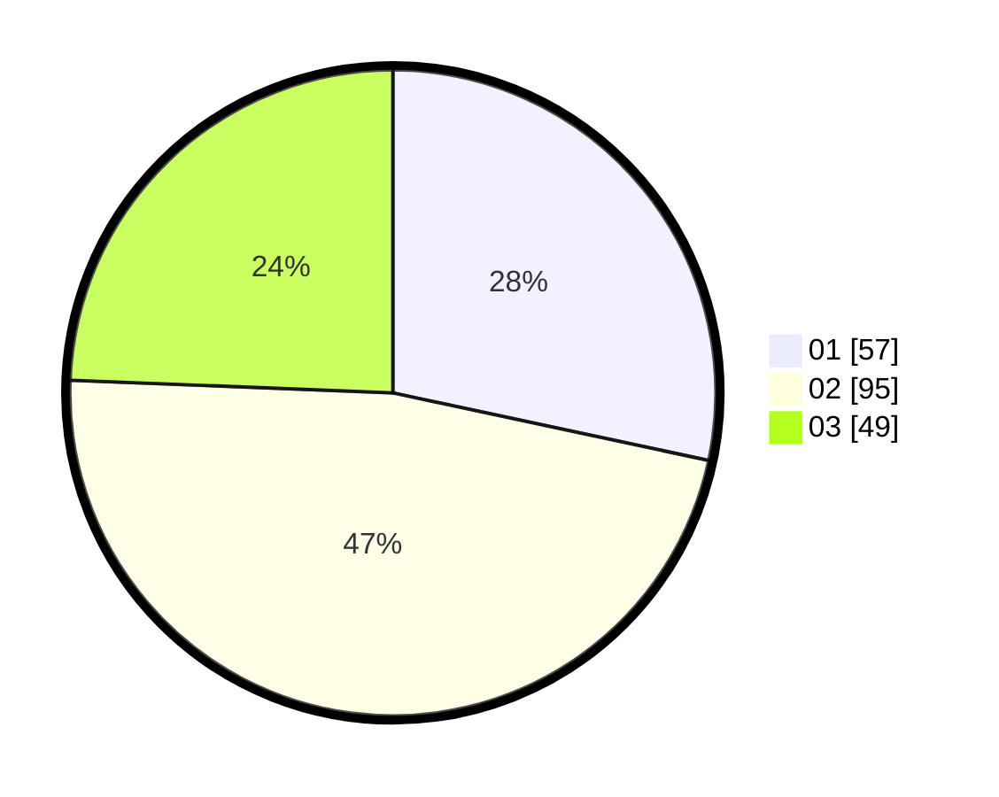

# Hasil

Hasil perolehan suara paslon dapat dilihat pada file paslon-01.txt, paslon-02.txt, dan paslon-03.txt.

Jika tidak ada, artinya data tersebut belum ada pada SIREKAP.

## Perolehan Suara

 * Paslon 01: **57**.
 * Paslon 02: **95**.
 * Paslon 03: **49**.

## Foto C Plano

https://sirekap-obj-formc.kpu.go.id/b525/pemilu/ppwp/31/73/07/10/01/3173071001103-20240214-220326--cab739f9-5539-4b6f-96fc-d337edba28f2.jpg

https://sirekap-obj-formc.kpu.go.id/b525/pemilu/ppwp/31/73/07/10/01/3173071001103-20240214-220415--f9efad43-f347-4511-8e23-54ba357d04e9.jpg

https://sirekap-obj-formc.kpu.go.id/b525/pemilu/ppwp/31/73/07/10/01/3173071001103-20240214-220459--e6f0ec9e-adf1-46c5-9927-f7a4de467dbe.jpg
