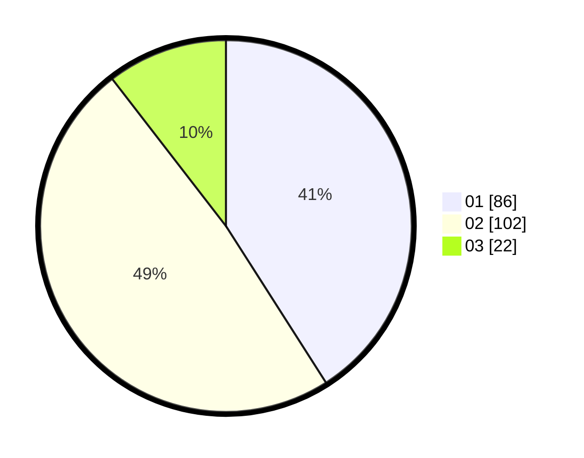

# Hasil

Hasil perolehan suara paslon dapat dilihat pada file paslon-01.txt, paslon-02.txt, dan paslon-03.txt.

Jika tidak ada, artinya data tersebut belum ada pada SIREKAP.

## Perolehan Suara

 * Paslon 01: **86**.
 * Paslon 02: **102**.
 * Paslon 03: **22**.

## Foto C Plano

https://sirekap-obj-formc.kpu.go.id/ee2f/pemilu/ppwp/31/73/07/10/01/3173071001107-20240214-155549--6b3bf749-610c-4765-8681-bc887a5b4474.jpg

https://sirekap-obj-formc.kpu.go.id/ee2f/pemilu/ppwp/31/73/07/10/01/3173071001107-20240214-155650--bde738ca-f92d-453a-9ecc-7315de6eedbf.jpg
