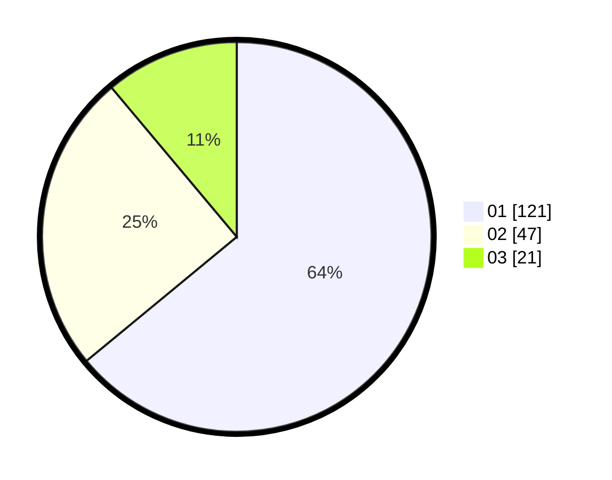

# Hasil

Hasil perolehan suara paslon dapat dilihat pada file paslon-01.txt, paslon-02.txt, dan paslon-03.txt.

Jika tidak ada, artinya data tersebut belum ada pada SIREKAP.

## Perolehan Suara

 * Paslon 01: **121**.
 * Paslon 02: **47**.
 * Paslon 03: **21**.

## Foto C Plano

https://sirekap-obj-formc.kpu.go.id/43f4/pemilu/ppwp/31/73/07/10/01/3173071001110-20240214-213301--142fb9a3-3dba-47bc-800c-f874313c9d95.jpg

https://sirekap-obj-formc.kpu.go.id/43f4/pemilu/ppwp/31/73/07/10/01/3173071001110-20240214-213400--56406fa0-665a-472b-9f5f-0da64e6fd362.jpg

https://sirekap-obj-formc.kpu.go.id/43f4/pemilu/ppwp/31/73/07/10/01/3173071001110-20240214-213443--1ace74a8-3912-4bb3-a88a-a2deccaf8939.jpg
