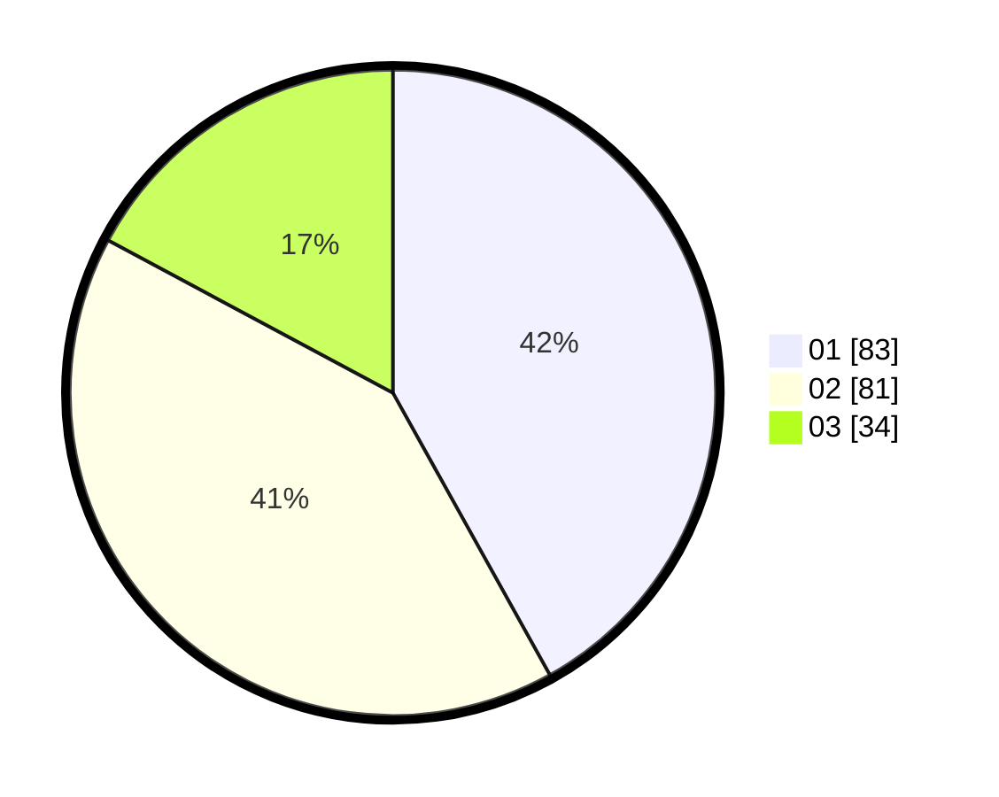

# Hasil

Hasil perolehan suara paslon dapat dilihat pada file paslon-01.txt, paslon-02.txt, dan paslon-03.txt.

Jika tidak ada, artinya data tersebut belum ada pada SIREKAP.

## Perolehan Suara

 * Paslon 01: **83**.
 * Paslon 02: **81**.
 * Paslon 03: **34**.

## Foto C Plano

https://sirekap-obj-formc.kpu.go.id/d30a/pemilu/ppwp/31/73/07/10/01/3173071001115-20240214-234303--631282d1-06a9-422e-a3d9-5f9d04ea8d33.jpg

https://sirekap-obj-formc.kpu.go.id/d30a/pemilu/ppwp/31/73/07/10/01/3173071001115-20240214-234424--09d79f11-2cb7-41ac-b54c-3a948aafef25.jpg

https://sirekap-obj-formc.kpu.go.id/d30a/pemilu/ppwp/31/73/07/10/01/3173071001115-20240214-234538--134492c3-91dc-477c-9130-b6bf6900b8fb.jpg

## DATA PEMILIH TETAP

Jumlah pemilih dalam DPT: **267**.
 * L: **127**.
 * P: **140**.

## DATA PENGGUNA HAK PILIH

Jumlah pengguna hak pilih dalam DPT: **197**.
 * L: **90**.
 * P: **107**.

Jumlah pengguna hak pilih dalam DPTb: **2**.
 * L: **2**.
 * P: **0**.

Jumlah pengguna hak pilih dalam DPK: **1**.
 * L: **0**.
 * P: **1**.

Jumlah pengguna hak pilih: **200**.
 * L: **92**.
 * P: **108**.

## JUMLAH SUARA SAH DAN TIDAK SAH

JUMLAH SELURUH SUARA SAH: **198**.

JUMLAH SUARA TIDAK SAH: **2**.

JUMLAH SELURUH SUARA SAH DAN SUARA TIDAK SAH: **200**.
