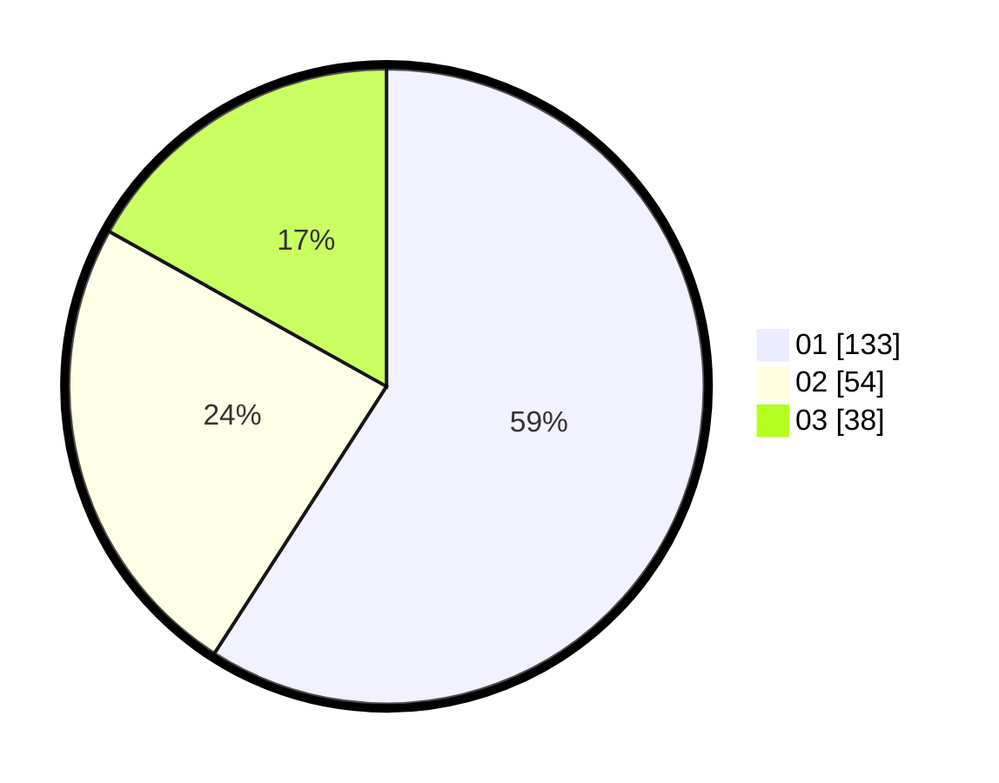

# Hasil

Hasil perolehan suara paslon dapat dilihat pada file paslon-01.txt, paslon-02.txt, dan paslon-03.txt.

Jika tidak ada, artinya data tersebut belum ada pada SIREKAP.

## Perolehan Suara

 * Paslon 01: **133**.
 * Paslon 02: **54**.
 * Paslon 03: **38**.

## Foto C Plano

https://sirekap-obj-formc.kpu.go.id/9c88/pemilu/ppwp/31/73/07/10/01/3173071001116-20240214-211232--fa0f272b-23b0-49fd-a8e7-4f59508423dd.jpg

https://sirekap-obj-formc.kpu.go.id/9c88/pemilu/ppwp/31/73/07/10/01/3173071001116-20240214-211301--870f3e9f-dd8c-4b56-8922-2ba06003e836.jpg

https://sirekap-obj-formc.kpu.go.id/9c88/pemilu/ppwp/31/73/07/10/01/3173071001116-20240214-211339--56e51fa3-d67f-4832-9e6f-9eb55806a534.jpg

## DATA PEMILIH TETAP

Jumlah pemilih dalam DPT: **266**.
 * L: **128**.
 * P: **138**.

## DATA PENGGUNA HAK PILIH

Jumlah pengguna hak pilih dalam DPT: **228**.
 * L: **108**.
 * P: **120**.

Jumlah pengguna hak pilih dalam DPTb: **4**.
 * L: **2**.
 * P: **2**.

Jumlah pengguna hak pilih dalam DPK: **7**.
 * L: **3**.
 * P: **4**.

Jumlah pengguna hak pilih: **239**.
 * L: **113**.
 * P: **126**.

## JUMLAH SUARA SAH DAN TIDAK SAH

JUMLAH SELURUH SUARA SAH: **235**.

JUMLAH SUARA TIDAK SAH: **4**.

JUMLAH SELURUH SUARA SAH DAN SUARA TIDAK SAH: **239**.
