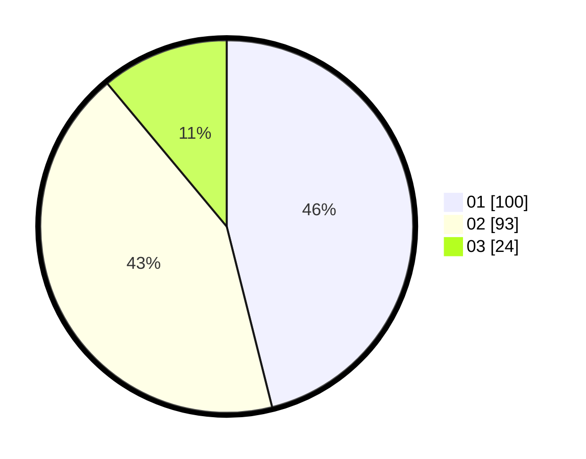

# Hasil

Hasil perolehan suara paslon dapat dilihat pada file paslon-01.txt, paslon-02.txt, dan paslon-03.txt.

Jika tidak ada, artinya data tersebut belum ada pada SIREKAP.

## Perolehan Suara

 * Paslon 01: **100**.
 * Paslon 02: **93**.
 * Paslon 03: **24**.

## Foto C Plano

https://sirekap-obj-formc.kpu.go.id/5196/pemilu/ppwp/31/73/07/10/01/3173071001127-20240214-193124--6349abe5-2b94-4bed-a9eb-cca037cccbda.jpg

https://sirekap-obj-formc.kpu.go.id/5196/pemilu/ppwp/31/73/07/10/01/3173071001127-20240214-193253--9602bf01-2db9-48fa-9dce-a37f981dafa3.jpg

https://sirekap-obj-formc.kpu.go.id/5196/pemilu/ppwp/31/73/07/10/01/3173071001127-20240214-195949--bcf59bb0-df69-4a40-920e-edfcff13d298.jpg

## DATA PEMILIH TETAP

Jumlah pemilih dalam DPT: **281**.
 * L: **138**.
 * P: **143**.

## DATA PENGGUNA HAK PILIH

Jumlah pengguna hak pilih dalam DPT: **219**.
 * L: **106**.
 * P: **113**.

Jumlah pengguna hak pilih dalam DPTb: **1**.
 * L: **1**.
 * P: **0**.

Jumlah pengguna hak pilih dalam DPK: **2**.
 * L: **0**.
 * P: **2**.

Jumlah pengguna hak pilih: **222**.
 * L: **107**.
 * P: **115**.

## JUMLAH SUARA SAH DAN TIDAK SAH

JUMLAH SELURUH SUARA SAH: **217**.

JUMLAH SUARA TIDAK SAH: **5**.

JUMLAH SELURUH SUARA SAH DAN SUARA TIDAK SAH: **222**.
