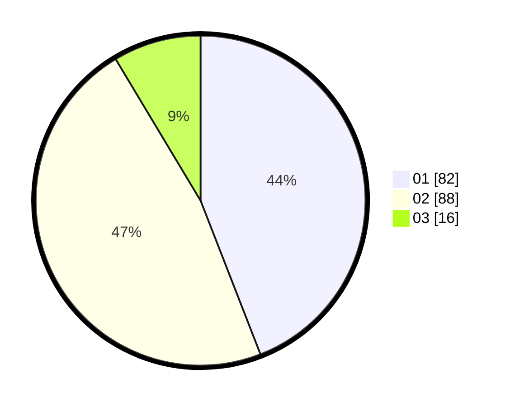

# Hasil

Hasil perolehan suara paslon dapat dilihat pada file paslon-01.txt, paslon-02.txt, dan paslon-03.txt.

Jika tidak ada, artinya data tersebut belum ada pada SIREKAP.

## Perolehan Suara

 * Paslon 01: **82**.
 * Paslon 02: **88**.
 * Paslon 03: **16**.

## Foto C Plano

https://sirekap-obj-formc.kpu.go.id/7375/pemilu/ppwp/31/73/07/10/01/3173071001129-20240214-232958--a23c3156-d10a-4d03-91d1-9ff898312e02.jpg

https://sirekap-obj-formc.kpu.go.id/7375/pemilu/ppwp/31/73/07/10/01/3173071001129-20240214-233104--3f197d5f-11f5-48f0-8b94-c6b36c1483ee.jpg

https://sirekap-obj-formc.kpu.go.id/7375/pemilu/ppwp/31/73/07/10/01/3173071001129-20240214-205651--7b807905-2021-4f7c-9c34-254332383e87.jpg
