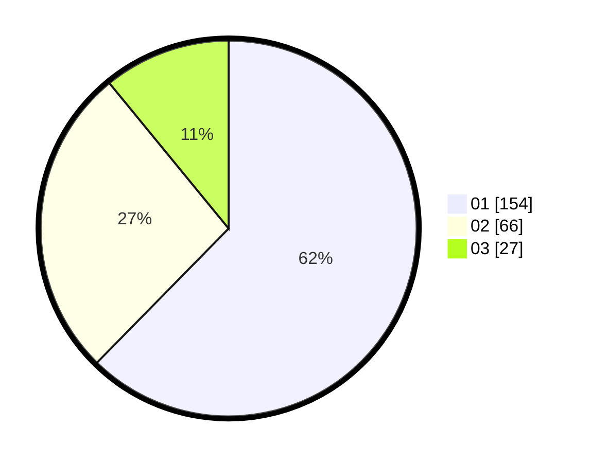

# Hasil

Hasil perolehan suara paslon dapat dilihat pada file paslon-01.txt, paslon-02.txt, dan paslon-03.txt.

Jika tidak ada, artinya data tersebut belum ada pada SIREKAP.

## Perolehan Suara

 * Paslon 01: **154**.
 * Paslon 02: **66**.
 * Paslon 03: **27**.

## Foto C Plano

https://sirekap-obj-formc.kpu.go.id/df03/pemilu/ppwp/31/73/07/10/01/3173071001131-20240214-205016--5a4cf4d2-dc89-4918-9711-bbb1a893a55b.jpg

https://sirekap-obj-formc.kpu.go.id/df03/pemilu/ppwp/31/73/07/10/01/3173071001131-20240214-205117--b59827f9-2c83-4a2d-bf06-a5f3b0f08082.jpg

https://sirekap-obj-formc.kpu.go.id/df03/pemilu/ppwp/31/73/07/10/01/3173071001131-20240214-205205--812203c0-dd3f-4ccb-a48b-cfdcd76068cf.jpg
