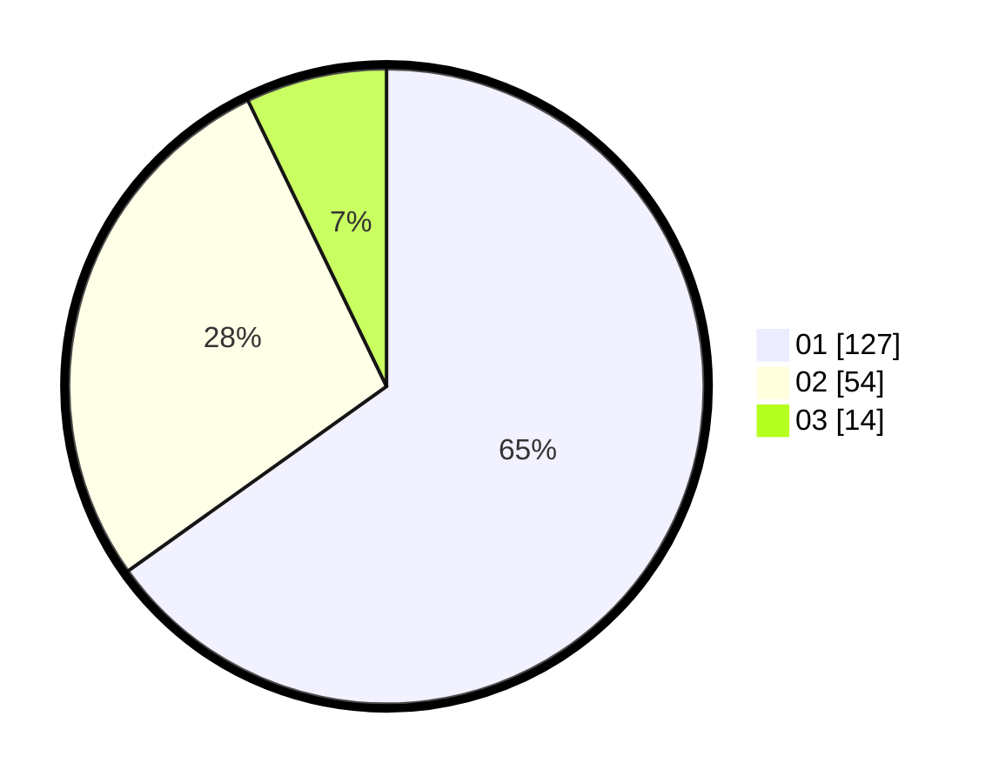

# Hasil

Hasil perolehan suara paslon dapat dilihat pada file paslon-01.txt, paslon-02.txt, dan paslon-03.txt.

Jika tidak ada, artinya data tersebut belum ada pada SIREKAP.

## Perolehan Suara

 * Paslon 01: **127**.
 * Paslon 02: **54**.
 * Paslon 03: **14**.

## Foto C Plano

https://sirekap-obj-formc.kpu.go.id/3199/pemilu/ppwp/31/73/07/10/01/3173071001132-20240215-002044--9e69e7b9-d04f-49cb-9ec6-172958c23e57.jpg

https://sirekap-obj-formc.kpu.go.id/3199/pemilu/ppwp/31/73/07/10/01/3173071001132-20240215-002050--3a2bd366-08f3-4e79-81ac-12a3b7199e34.jpg

https://sirekap-obj-formc.kpu.go.id/3199/pemilu/ppwp/31/73/07/10/01/3173071001132-20240215-002053--82920571-8ed2-4dc0-aa99-0f769de20888.jpg
