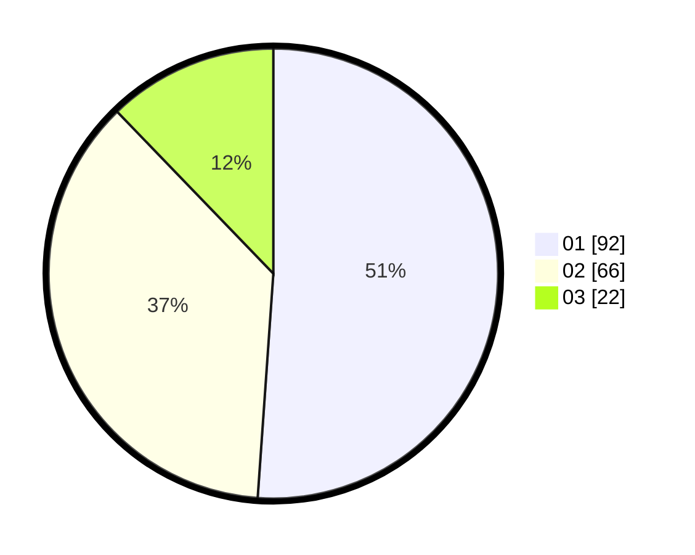

# Hasil

Hasil perolehan suara paslon dapat dilihat pada file paslon-01.txt, paslon-02.txt, dan paslon-03.txt.

Jika tidak ada, artinya data tersebut belum ada pada SIREKAP.

## Perolehan Suara

 * Paslon 01: **92**.
 * Paslon 02: **66**.
 * Paslon 03: **22**.

## Foto C Plano

https://sirekap-obj-formc.kpu.go.id/ee0d/pemilu/ppwp/31/73/07/10/01/3173071001134-20240215-005525--5c8b8a0a-7676-4838-9bf8-fdd6b3c3e0e8.jpg

https://sirekap-obj-formc.kpu.go.id/ee0d/pemilu/ppwp/31/73/07/10/01/3173071001134-20240215-005618--bd405e3a-b80d-428c-a1e8-c5aa57d6de2d.jpg

https://sirekap-obj-formc.kpu.go.id/ee0d/pemilu/ppwp/31/73/07/10/01/3173071001134-20240215-005646--d9e007e6-326d-43ed-a418-9d0c22823e12.jpg
