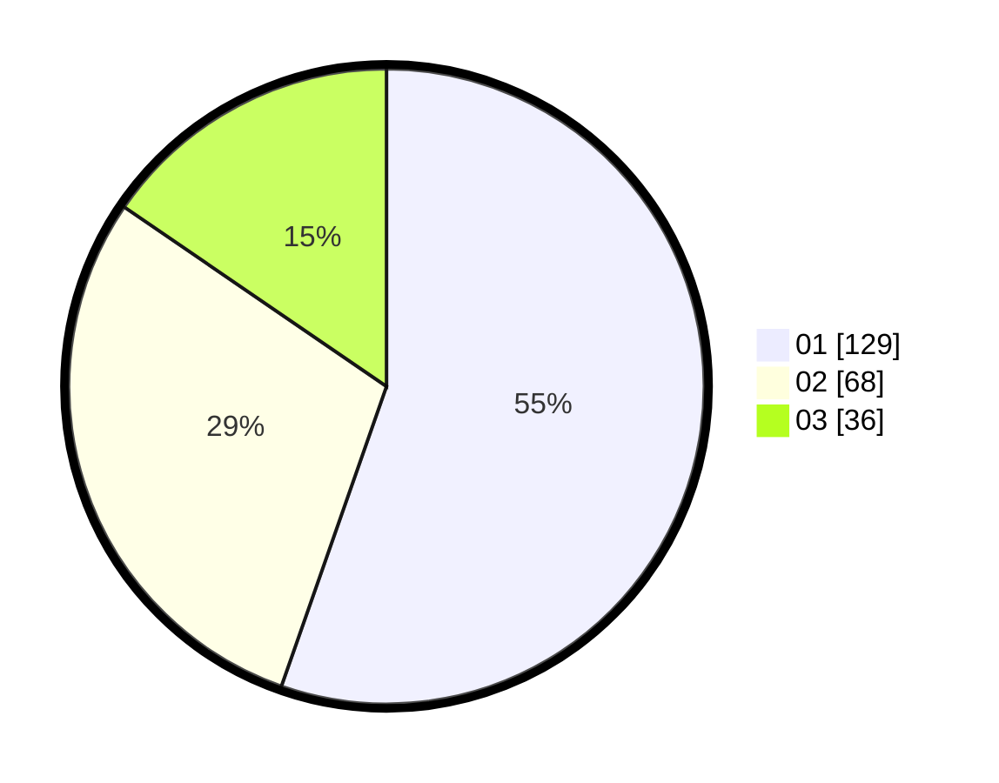

# Hasil

Hasil perolehan suara paslon dapat dilihat pada file paslon-01.txt, paslon-02.txt, dan paslon-03.txt.

Jika tidak ada, artinya data tersebut belum ada pada SIREKAP.

## Perolehan Suara

 * Paslon 01: **129**.
 * Paslon 02: **68**.
 * Paslon 03: **36**.

## Foto C Plano

https://sirekap-obj-formc.kpu.go.id/b04c/pemilu/ppwp/31/73/07/10/01/3173071001137-20240214-155652--7ae30f33-4901-4188-bb0b-de12c5ad089b.jpg

https://sirekap-obj-formc.kpu.go.id/b04c/pemilu/ppwp/31/73/07/10/01/3173071001137-20240214-155727--51073a8c-8a4b-4874-b67b-97135af4410c.jpg

https://sirekap-obj-formc.kpu.go.id/b04c/pemilu/ppwp/31/73/07/10/01/3173071001137-20240214-155804--f5597023-bb03-4519-a89a-cad1eb314348.jpg

## DATA PEMILIH TETAP

Jumlah pemilih dalam DPT: **285**.
 * L: **137**.
 * P: **148**.

## DATA PENGGUNA HAK PILIH

Jumlah pengguna hak pilih dalam DPT: **225**.
 * L: **104**.
 * P: **121**.

Jumlah pengguna hak pilih dalam DPTb: **4**.
 * L: **2**.
 * P: **2**.

Jumlah pengguna hak pilih dalam DPK: **7**.
 * L: **4**.
 * P: **3**.

Jumlah pengguna hak pilih: **236**.
 * L: **110**.
 * P: **126**.

## JUMLAH SUARA SAH DAN TIDAK SAH

JUMLAH SELURUH SUARA SAH: **233**.

JUMLAH SUARA TIDAK SAH: **3**.

JUMLAH SELURUH SUARA SAH DAN SUARA TIDAK SAH: **236**.
