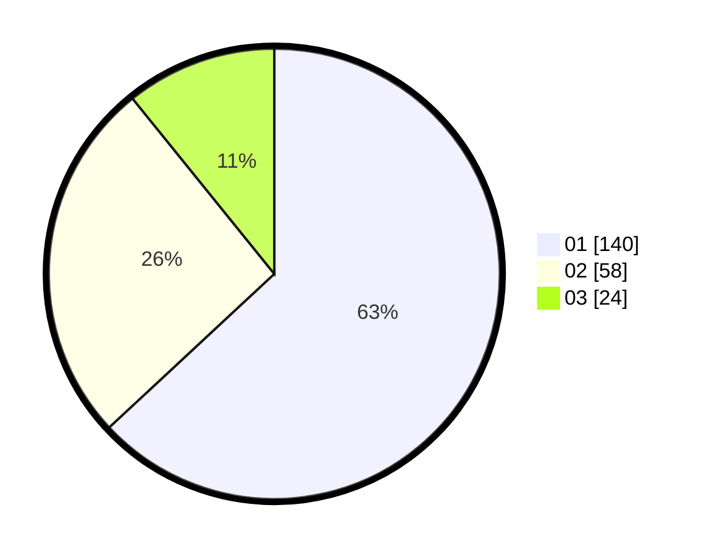

# Hasil

Hasil perolehan suara paslon dapat dilihat pada file paslon-01.txt, paslon-02.txt, dan paslon-03.txt.

Jika tidak ada, artinya data tersebut belum ada pada SIREKAP.

## Perolehan Suara

 * Paslon 01: **140**.
 * Paslon 02: **58**.
 * Paslon 03: **24**.

## Foto C Plano

https://sirekap-obj-formc.kpu.go.id/7998/pemilu/ppwp/31/73/07/10/01/3173071001139-20240214-224129--a9375aad-f971-4308-bcd5-4df38a2e6cf0.jpg

https://sirekap-obj-formc.kpu.go.id/7998/pemilu/ppwp/31/73/07/10/01/3173071001139-20240214-224238--d58cdbe7-213f-43c6-8c26-9b2389ca9ede.jpg

https://sirekap-obj-formc.kpu.go.id/7998/pemilu/ppwp/31/73/07/10/01/3173071001139-20240214-224340--320c3cdf-697d-44a5-88cb-aba635e66919.jpg
