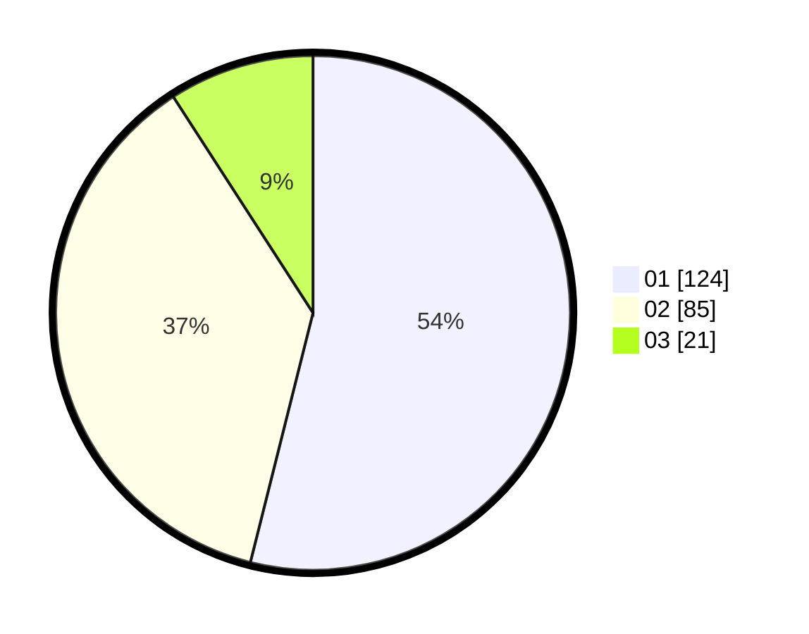

# Hasil

Hasil perolehan suara paslon dapat dilihat pada file paslon-01.txt, paslon-02.txt, dan paslon-03.txt.

Jika tidak ada, artinya data tersebut belum ada pada SIREKAP.

## Perolehan Suara

 * Paslon 01: **124**.
 * Paslon 02: **85**.
 * Paslon 03: **21**.

## Foto C Plano

https://sirekap-obj-formc.kpu.go.id/a084/pemilu/ppwp/31/73/07/10/01/3173071001147-20240214-225547--dbfdafcc-27a6-4e75-9082-3ba6ae273697.jpg

https://sirekap-obj-formc.kpu.go.id/a084/pemilu/ppwp/31/73/07/10/01/3173071001147-20240214-225705--c4d78be3-65a7-45f4-9e00-63742db83fc0.jpg

https://sirekap-obj-formc.kpu.go.id/a084/pemilu/ppwp/31/73/07/10/01/3173071001147-20240214-225810--a9dd0d49-d6d6-4b91-9248-929a1e76b9fc.jpg
