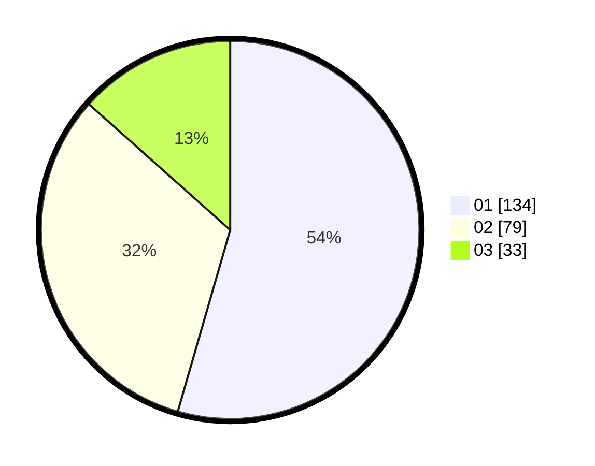

# Hasil

Hasil perolehan suara paslon dapat dilihat pada file paslon-01.txt, paslon-02.txt, dan paslon-03.txt.

Jika tidak ada, artinya data tersebut belum ada pada SIREKAP.

## Perolehan Suara

 * Paslon 01: **134**.
 * Paslon 02: **79**.
 * Paslon 03: **33**.

## Foto C Plano

https://sirekap-obj-formc.kpu.go.id/233c/pemilu/ppwp/31/73/07/10/01/3173071001155-20240214-220819--9862d3f9-3894-40cf-9a34-04c4059fdd32.jpg

https://sirekap-obj-formc.kpu.go.id/233c/pemilu/ppwp/31/73/07/10/01/3173071001155-20240214-220924--afb1e4dd-ad4e-43bb-bdbb-332e8b20716b.jpg

https://sirekap-obj-formc.kpu.go.id/233c/pemilu/ppwp/31/73/07/10/01/3173071001155-20240214-221002--5ed2c7fd-8454-4327-8fad-300eebed6d46.jpg
