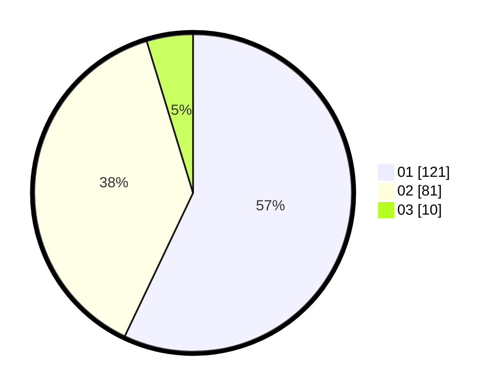

# Hasil

Hasil perolehan suara paslon dapat dilihat pada file paslon-01.txt, paslon-02.txt, dan paslon-03.txt.

Jika tidak ada, artinya data tersebut belum ada pada SIREKAP.

## Perolehan Suara

 * Paslon 01: **121**.
 * Paslon 02: **81**.
 * Paslon 03: **10**.

## Foto C Plano

https://sirekap-obj-formc.kpu.go.id/d987/pemilu/ppwp/31/73/07/10/01/3173071001159-20240216-034903--cd39a7c7-0959-40f8-a399-055d47bf0ea9.jpg

https://sirekap-obj-formc.kpu.go.id/d987/pemilu/ppwp/31/73/07/10/01/3173071001159-20240216-033104--de3bd7ec-8624-4f8a-a7e9-3980deed6809.jpg

https://sirekap-obj-formc.kpu.go.id/d987/pemilu/ppwp/31/73/07/10/01/3173071001159-20240216-033103--1429b72f-d07f-4a42-88d1-1115672b8427.jpg

## DATA PEMILIH TETAP

Jumlah pemilih dalam DPT: **252**.
 * L: **130**.
 * P: **122**.

## DATA PENGGUNA HAK PILIH

Jumlah pengguna hak pilih dalam DPT: **195**.
 * L: **95**.
 * P: **100**.

Jumlah pengguna hak pilih dalam DPTb: **20**.
 * L: **6**.
 * P: **14**.

Jumlah pengguna hak pilih dalam DPK: **0**.
 * L: **0**.
 * P: **0**.

Jumlah pengguna hak pilih: **215**.
 * L: **101**.
 * P: **114**.

## JUMLAH SUARA SAH DAN TIDAK SAH

JUMLAH SELURUH SUARA SAH: **212**.

JUMLAH SUARA TIDAK SAH: **3**.

JUMLAH SELURUH SUARA SAH DAN SUARA TIDAK SAH: **215**.
