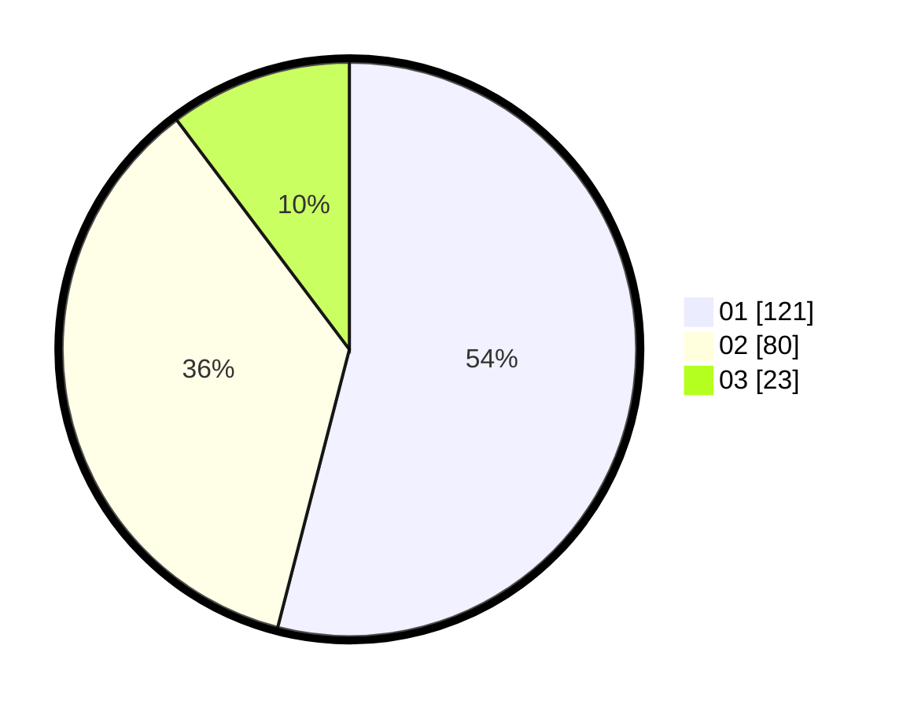

# Hasil

Hasil perolehan suara paslon dapat dilihat pada file paslon-01.txt, paslon-02.txt, dan paslon-03.txt.

Jika tidak ada, artinya data tersebut belum ada pada SIREKAP.

## Perolehan Suara

 * Paslon 01: **121**.
 * Paslon 02: **80**.
 * Paslon 03: **23**.

## Foto C Plano

https://sirekap-obj-formc.kpu.go.id/7850/pemilu/ppwp/31/73/07/10/01/3173071001160-20240215-083250--a18c72d8-804a-4742-963f-33e96bc48f2a.jpg

https://sirekap-obj-formc.kpu.go.id/7850/pemilu/ppwp/31/73/07/10/01/3173071001160-20240214-155806--b37a40bc-0412-45c3-9d02-1de8068c60f3.jpg

https://sirekap-obj-formc.kpu.go.id/7850/pemilu/ppwp/31/73/07/10/01/3173071001160-20240214-155705--8d50366b-6b5e-4869-8e17-e80d3064c400.jpg

## DATA PEMILIH TETAP

Jumlah pemilih dalam DPT: **258**.
 * L: **128**.
 * P: **130**.

## DATA PENGGUNA HAK PILIH

Jumlah pengguna hak pilih dalam DPT: **202**.
 * L: **97**.
 * P: **105**.

Jumlah pengguna hak pilih dalam DPTb: **19**.
 * L: **9**.
 * P: **10**.

Jumlah pengguna hak pilih dalam DPK: **5**.
 * L: **3**.
 * P: **2**.

Jumlah pengguna hak pilih: **226**.
 * L: **109**.
 * P: **117**.

## JUMLAH SUARA SAH DAN TIDAK SAH

JUMLAH SELURUH SUARA SAH: **224**.

JUMLAH SUARA TIDAK SAH: **2**.

JUMLAH SELURUH SUARA SAH DAN SUARA TIDAK SAH: **226**.
