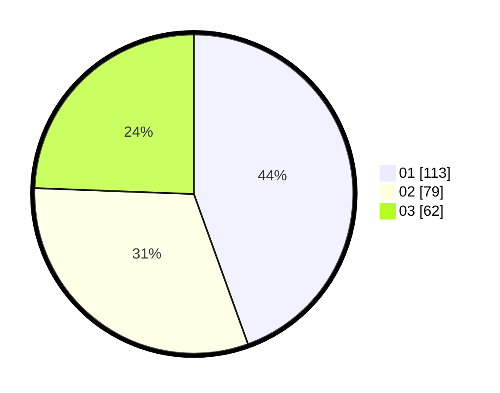

# Hasil

Hasil perolehan suara paslon dapat dilihat pada file paslon-01.txt, paslon-02.txt, dan paslon-03.txt.

Jika tidak ada, artinya data tersebut belum ada pada SIREKAP.

## Perolehan Suara

 * Paslon 01: **113**.
 * Paslon 02: **79**.
 * Paslon 03: **62**.

## Foto C Plano

https://sirekap-obj-formc.kpu.go.id/e71f/pemilu/ppwp/31/73/07/10/01/3173071001164-20240215-032136--f3ab51b4-f3ec-419f-8692-ef05dd680362.jpg

https://sirekap-obj-formc.kpu.go.id/e71f/pemilu/ppwp/31/73/07/10/01/3173071001164-20240215-032219--dbf4342a-23e4-4c69-a4e2-d359deddf3b6.jpg

https://sirekap-obj-formc.kpu.go.id/e71f/pemilu/ppwp/31/73/07/10/01/3173071001164-20240215-032026--d5638c10-d551-4bf8-bf37-3894c61d723e.jpg
