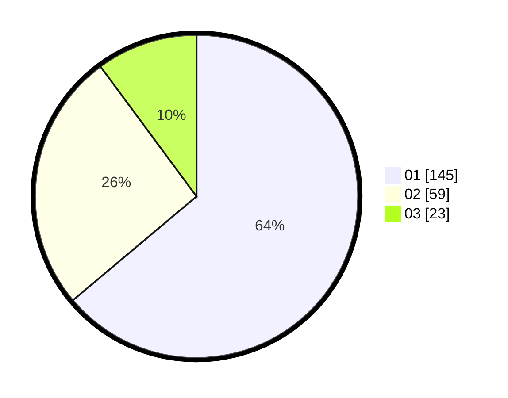

# Hasil

Hasil perolehan suara paslon dapat dilihat pada file paslon-01.txt, paslon-02.txt, dan paslon-03.txt.

Jika tidak ada, artinya data tersebut belum ada pada SIREKAP.

## Perolehan Suara

 * Paslon 01: **145**.
 * Paslon 02: **59**.
 * Paslon 03: **23**.

## Foto C Plano

https://sirekap-obj-formc.kpu.go.id/6b32/pemilu/ppwp/31/73/07/10/01/3173071001169-20240214-231805--301feb81-3847-4662-90ae-438440305099.jpg

https://sirekap-obj-formc.kpu.go.id/6b32/pemilu/ppwp/31/73/07/10/01/3173071001169-20240214-232015--48ef263f-1f7c-4df4-a0ac-5382cd232f40.jpg

https://sirekap-obj-formc.kpu.go.id/6b32/pemilu/ppwp/31/73/07/10/01/3173071001169-20240214-232145--6794c1bf-edab-47ce-8e0f-a4e0ecd423e4.jpg

## DATA PEMILIH TETAP

Jumlah pemilih dalam DPT: **779**.
 * L: **144**.
 * P: **135**.

## DATA PENGGUNA HAK PILIH

Jumlah pengguna hak pilih dalam DPT: **225**.
 * L: **115**.
 * P: **109**.

Jumlah pengguna hak pilih dalam DPTb: **3**.
 * L: **2**.
 * P: **1**.

Jumlah pengguna hak pilih dalam DPK: **3**.
 * L: **0**.
 * P: **3**.

Jumlah pengguna hak pilih: **231**.
 * L: **118**.
 * P: **113**.

## JUMLAH SUARA SAH DAN TIDAK SAH

JUMLAH SELURUH SUARA SAH: **227**.

JUMLAH SUARA TIDAK SAH: **4**.

JUMLAH SELURUH SUARA SAH DAN SUARA TIDAK SAH: **231**.
