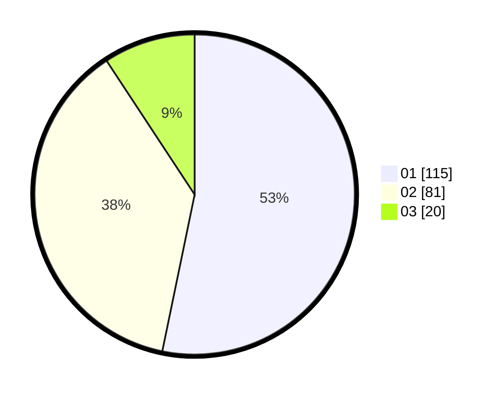

# Hasil

Hasil perolehan suara paslon dapat dilihat pada file paslon-01.txt, paslon-02.txt, dan paslon-03.txt.

Jika tidak ada, artinya data tersebut belum ada pada SIREKAP.

## Perolehan Suara

 * Paslon 01: **115**.
 * Paslon 02: **81**.
 * Paslon 03: **20**.

## Foto C Plano

https://sirekap-obj-formc.kpu.go.id/bbeb/pemilu/ppwp/31/73/07/10/01/3173071001170-20240214-185353--31d53ae3-b829-46fd-a8b9-a8c9227467e8.jpg

https://sirekap-obj-formc.kpu.go.id/bbeb/pemilu/ppwp/31/73/07/10/01/3173071001170-20240214-222931--b34c5d1a-4d6d-4ad1-91f8-cf5dc34d38ab.jpg

https://sirekap-obj-formc.kpu.go.id/bbeb/pemilu/ppwp/31/73/07/10/01/3173071001170-20240214-223359--94eb19ec-ff41-480b-ba65-ccaddc8a4f81.jpg

## DATA PEMILIH TETAP

Jumlah pemilih dalam DPT: **281**.
 * L: **146**.
 * P: **135**.

## DATA PENGGUNA HAK PILIH

Jumlah pengguna hak pilih dalam DPT: **216**.
 * L: **110**.
 * P: **106**.

Jumlah pengguna hak pilih dalam DPTb: **3**.
 * L: **0**.
 * P: **3**.

Jumlah pengguna hak pilih dalam DPK: **4**.
 * L: **1**.
 * P: **3**.

Jumlah pengguna hak pilih: **223**.
 * L: **111**.
 * P: **112**.

## JUMLAH SUARA SAH DAN TIDAK SAH

JUMLAH SELURUH SUARA SAH: **216**.

JUMLAH SUARA TIDAK SAH: **7**.

JUMLAH SELURUH SUARA SAH DAN SUARA TIDAK SAH: **223**.
