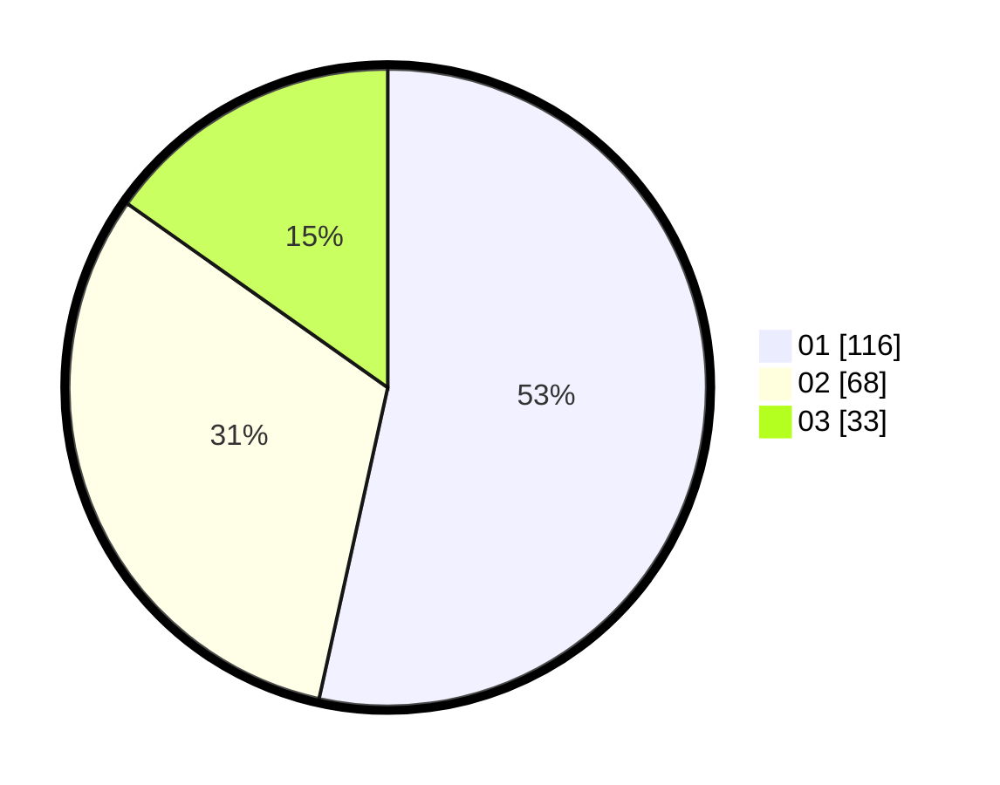

# Hasil

Hasil perolehan suara paslon dapat dilihat pada file paslon-01.txt, paslon-02.txt, dan paslon-03.txt.

Jika tidak ada, artinya data tersebut belum ada pada SIREKAP.

## Perolehan Suara

 * Paslon 01: **116**.
 * Paslon 02: **68**.
 * Paslon 03: **33**.

## Foto C Plano

https://sirekap-obj-formc.kpu.go.id/4e80/pemilu/ppwp/31/73/07/10/01/3173071001171-20240218-165012--8613cc3f-f5d2-4644-9e88-cb9718d184bf.jpg

https://sirekap-obj-formc.kpu.go.id/4e80/pemilu/ppwp/31/73/07/10/01/3173071001171-20240218-165013--daa9f761-5de1-4511-90a8-eb8a59c2d3c3.jpg

https://sirekap-obj-formc.kpu.go.id/4e80/pemilu/ppwp/31/73/07/10/01/3173071001171-20240218-165012--b5b78099-97d2-4e0d-ab89-27f65ee1ac17.jpg

## DATA PEMILIH TETAP

Jumlah pemilih dalam DPT: **279**.
 * L: **127**.
 * P: **152**.

## DATA PENGGUNA HAK PILIH

Jumlah pengguna hak pilih dalam DPT: **213**.
 * L: **93**.
 * P: **120**.

Jumlah pengguna hak pilih dalam DPTb: **6**.
 * L: **2**.
 * P: **4**.

Jumlah pengguna hak pilih dalam DPK: **3**.
 * L: **1**.
 * P: **2**.

Jumlah pengguna hak pilih: **222**.
 * L: **96**.
 * P: **126**.

## JUMLAH SUARA SAH DAN TIDAK SAH

JUMLAH SELURUH SUARA SAH: **217**.

JUMLAH SUARA TIDAK SAH: **5**.

JUMLAH SELURUH SUARA SAH DAN SUARA TIDAK SAH: **222**.
