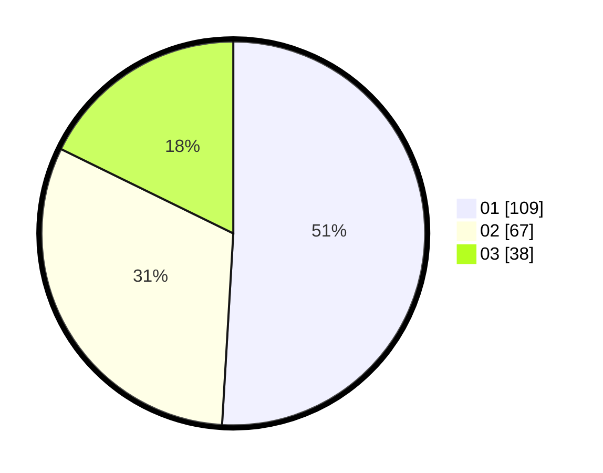

# Hasil

Hasil perolehan suara paslon dapat dilihat pada file paslon-01.txt, paslon-02.txt, dan paslon-03.txt.

Jika tidak ada, artinya data tersebut belum ada pada SIREKAP.

## Perolehan Suara

 * Paslon 01: **109**.
 * Paslon 02: **67**.
 * Paslon 03: **38**.

## Foto C Plano

https://sirekap-obj-formc.kpu.go.id/401b/pemilu/ppwp/31/73/07/10/01/3173071001174-20240214-215949--fc57a185-fd42-45ca-b278-73edb552fdfa.jpg

https://sirekap-obj-formc.kpu.go.id/401b/pemilu/ppwp/31/73/07/10/01/3173071001174-20240214-220048--b0ce77ba-9850-4a21-a84f-40eca60b68e1.jpg

https://sirekap-obj-formc.kpu.go.id/401b/pemilu/ppwp/31/73/07/10/01/3173071001174-20240214-214714--bdae21e7-3d75-4699-8b41-934fc19a0d4e.jpg
