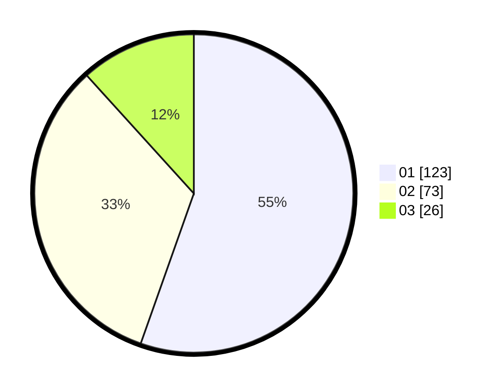

# Hasil

Hasil perolehan suara paslon dapat dilihat pada file paslon-01.txt, paslon-02.txt, dan paslon-03.txt.

Jika tidak ada, artinya data tersebut belum ada pada SIREKAP.

## Perolehan Suara

 * Paslon 01: **123**.
 * Paslon 02: **73**.
 * Paslon 03: **26**.

## Foto C Plano

https://sirekap-obj-formc.kpu.go.id/9128/pemilu/ppwp/31/73/07/10/01/3173071001175-20240214-232733--e58d4f3b-aa34-4a42-8cae-7ee0ab67fce5.jpg

https://sirekap-obj-formc.kpu.go.id/9128/pemilu/ppwp/31/73/07/10/01/3173071001175-20240214-232833--ca4e0059-b49f-435c-9ea0-c559a96bf346.jpg

https://sirekap-obj-formc.kpu.go.id/9128/pemilu/ppwp/31/73/07/10/01/3173071001175-20240214-233008--89af0f04-0d26-4ddc-9fa5-a25bebbcfe94.jpg
