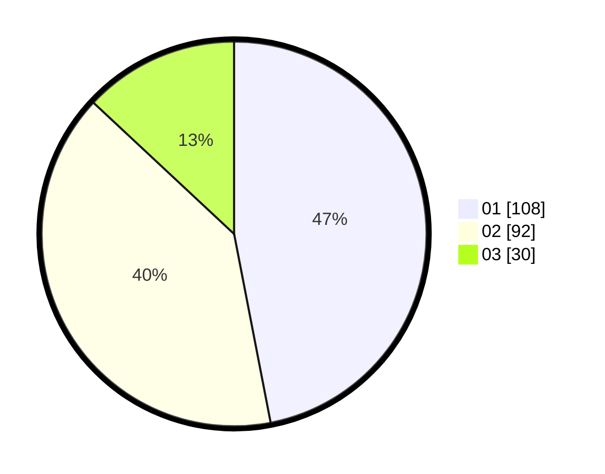

# Hasil

Hasil perolehan suara paslon dapat dilihat pada file paslon-01.txt, paslon-02.txt, dan paslon-03.txt.

Jika tidak ada, artinya data tersebut belum ada pada SIREKAP.

## Perolehan Suara

 * Paslon 01: **108**.
 * Paslon 02: **92**.
 * Paslon 03: **30**.

## Foto C Plano

https://sirekap-obj-formc.kpu.go.id/447f/pemilu/ppwp/31/73/07/10/01/3173071001177-20240214-220207--71b3a0f1-d083-4808-a71d-c459942318f0.jpg

https://sirekap-obj-formc.kpu.go.id/447f/pemilu/ppwp/31/73/07/10/01/3173071001177-20240214-220405--e9e752f2-339f-4049-b2d0-851f697909b4.jpg

https://sirekap-obj-formc.kpu.go.id/447f/pemilu/ppwp/31/73/07/10/01/3173071001177-20240214-220511--e4ac6ca8-7951-4598-845b-12a4f745b6a0.jpg
