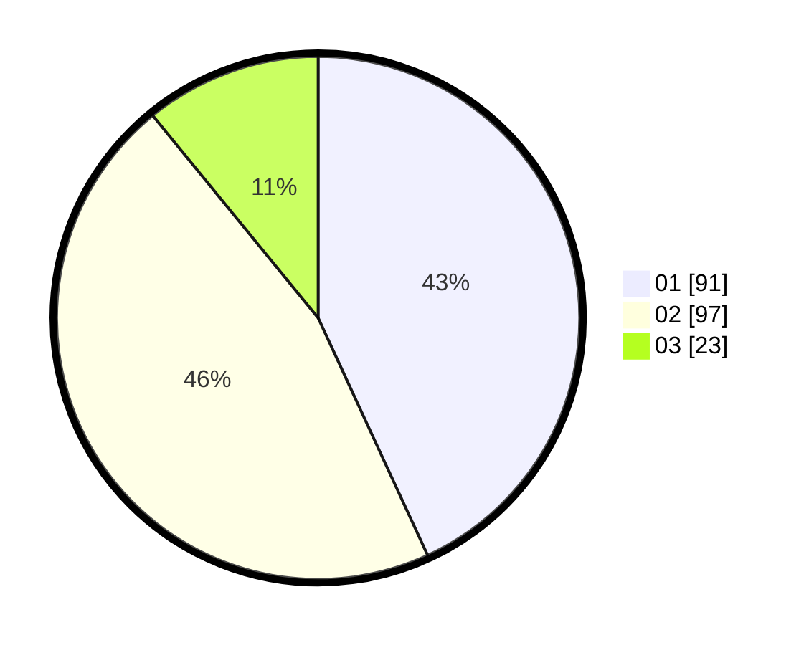

# Hasil

Hasil perolehan suara paslon dapat dilihat pada file paslon-01.txt, paslon-02.txt, dan paslon-03.txt.

Jika tidak ada, artinya data tersebut belum ada pada SIREKAP.

## Perolehan Suara

 * Paslon 01: **91**.
 * Paslon 02: **97**.
 * Paslon 03: **23**.

## Foto C Plano

https://sirekap-obj-formc.kpu.go.id/e740/pemilu/ppwp/31/73/07/10/01/3173071001179-20240214-155828--2d491936-7a5d-46b4-b2c3-56091d64166d.jpg

https://sirekap-obj-formc.kpu.go.id/e740/pemilu/ppwp/31/73/07/10/01/3173071001179-20240214-160102--e434e252-2bee-4916-b6ba-d23224fb6834.jpg

https://sirekap-obj-formc.kpu.go.id/e740/pemilu/ppwp/31/73/07/10/01/3173071001179-20240214-221639--466d3c54-af29-434e-9478-99ad5d329d4a.jpg
