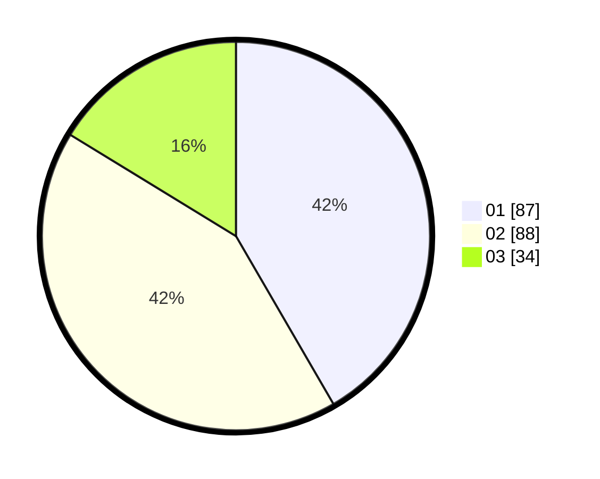

# Hasil

Hasil perolehan suara paslon dapat dilihat pada file paslon-01.txt, paslon-02.txt, dan paslon-03.txt.

Jika tidak ada, artinya data tersebut belum ada pada SIREKAP.

## Perolehan Suara

 * Paslon 01: **87**.
 * Paslon 02: **88**.
 * Paslon 03: **34**.

## Foto C Plano

https://sirekap-obj-formc.kpu.go.id/cd6f/pemilu/ppwp/31/73/07/10/01/3173071001180-20240214-225601--1c34123e-9852-49b7-a747-3f43d5b2187d.jpg

https://sirekap-obj-formc.kpu.go.id/cd6f/pemilu/ppwp/31/73/07/10/01/3173071001180-20240214-225725--42e409aa-16d6-424b-abb2-6f644149d320.jpg

https://sirekap-obj-formc.kpu.go.id/cd6f/pemilu/ppwp/31/73/07/10/01/3173071001180-20240214-225848--5be284e8-ec88-4c9a-bd6a-f757907ce040.jpg

## DATA PEMILIH TETAP

Jumlah pemilih dalam DPT: **274**.
 * L: **130**.
 * P: **144**.

## DATA PENGGUNA HAK PILIH

Jumlah pengguna hak pilih dalam DPT: **200**.
 * L: **86**.
 * P: **114**.

Jumlah pengguna hak pilih dalam DPTb: **11**.
 * L: **10**.
 * P: **1**.

Jumlah pengguna hak pilih dalam DPK: **2**.
 * L: **1**.
 * P: **1**.

Jumlah pengguna hak pilih: **213**.
 * L: **97**.
 * P: **116**.

## JUMLAH SUARA SAH DAN TIDAK SAH

JUMLAH SELURUH SUARA SAH: **209**.

JUMLAH SUARA TIDAK SAH: **4**.

JUMLAH SELURUH SUARA SAH DAN SUARA TIDAK SAH: **213**.
