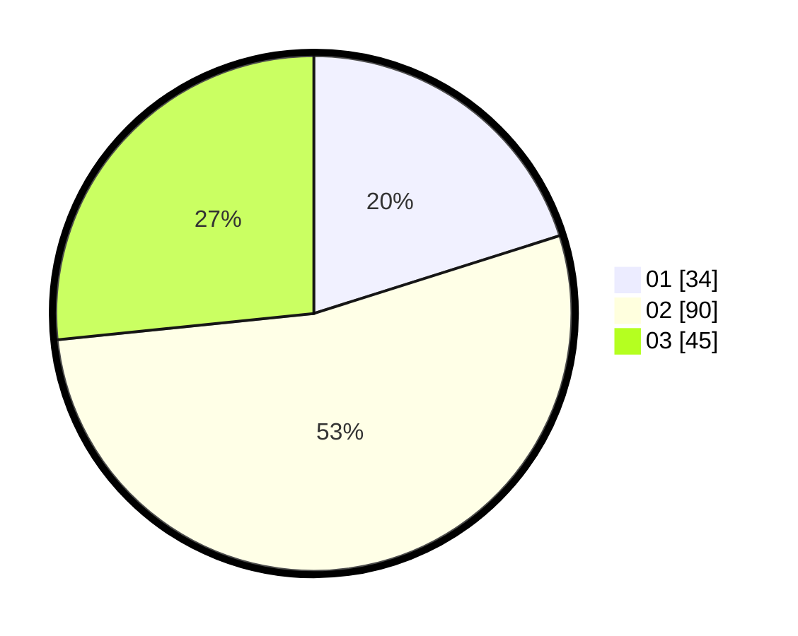

# Hasil

Hasil perolehan suara paslon dapat dilihat pada file paslon-01.txt, paslon-02.txt, dan paslon-03.txt.

Jika tidak ada, artinya data tersebut belum ada pada SIREKAP.

## Perolehan Suara

 * Paslon 01: **34**.
 * Paslon 02: **90**.
 * Paslon 03: **45**.

## Foto C Plano

https://sirekap-obj-formc.kpu.go.id/e7ec/pemilu/ppwp/31/73/07/10/01/3173071001183-20240214-202239--a48b86e1-fda3-4afb-8b0f-b1c83f60b95f.jpg

https://sirekap-obj-formc.kpu.go.id/e7ec/pemilu/ppwp/31/73/07/10/01/3173071001183-20240214-202356--cbe1bbe7-f6c9-42c8-a4d4-49f9acadd410.jpg

https://sirekap-obj-formc.kpu.go.id/e7ec/pemilu/ppwp/31/73/07/10/01/3173071001183-20240214-202532--6ada0b62-7270-4db7-a477-bd40c04c8f87.jpg
