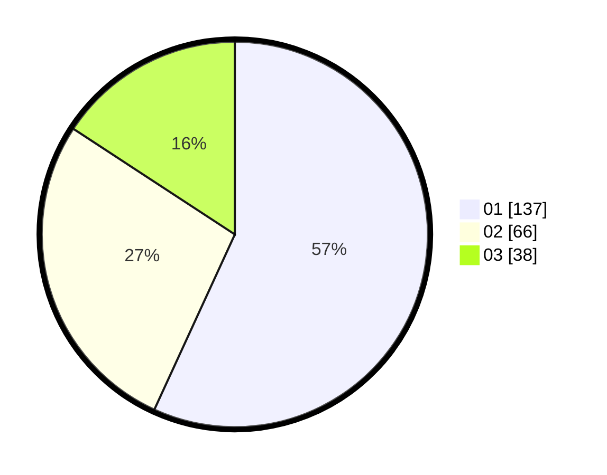

# Hasil

Hasil perolehan suara paslon dapat dilihat pada file paslon-01.txt, paslon-02.txt, dan paslon-03.txt.

Jika tidak ada, artinya data tersebut belum ada pada SIREKAP.

## Perolehan Suara

 * Paslon 01: **137**.
 * Paslon 02: **66**.
 * Paslon 03: **38**.

## Foto C Plano

https://sirekap-obj-formc.kpu.go.id/4d4b/pemilu/ppwp/31/73/07/10/01/3173071001185-20240214-223931--b78710c6-9f46-40bc-99e2-3541bad8f746.jpg

https://sirekap-obj-formc.kpu.go.id/4d4b/pemilu/ppwp/31/73/07/10/01/3173071001185-20240214-222922--b006d6d0-0770-48fd-a9f1-e99b54dbbc7c.jpg

https://sirekap-obj-formc.kpu.go.id/4d4b/pemilu/ppwp/31/73/07/10/01/3173071001185-20240214-223358--d98a29b8-e2dc-42c1-bc8a-0a497f9a3fa5.jpg

## DATA PEMILIH TETAP

Jumlah pemilih dalam DPT: **284**.
 * L: **132**.
 * P: **152**.

## DATA PENGGUNA HAK PILIH

Jumlah pengguna hak pilih dalam DPT: **239**.
 * L: **106**.
 * P: **133**.

Jumlah pengguna hak pilih dalam DPTb: **3**.
 * L: **1**.
 * P: **2**.

Jumlah pengguna hak pilih dalam DPK: **4**.
 * L: **1**.
 * P: **3**.

Jumlah pengguna hak pilih: **246**.
 * L: **108**.
 * P: **138**.

## JUMLAH SUARA SAH DAN TIDAK SAH

JUMLAH SELURUH SUARA SAH: **241**.

JUMLAH SUARA TIDAK SAH: **5**.

JUMLAH SELURUH SUARA SAH DAN SUARA TIDAK SAH: **246**.
