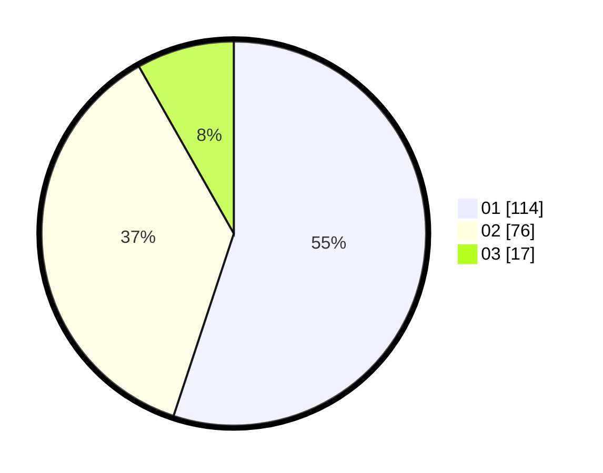

# Hasil

Hasil perolehan suara paslon dapat dilihat pada file paslon-01.txt, paslon-02.txt, dan paslon-03.txt.

Jika tidak ada, artinya data tersebut belum ada pada SIREKAP.

## Perolehan Suara

 * Paslon 01: **114**.
 * Paslon 02: **76**.
 * Paslon 03: **17**.

## Foto C Plano

https://sirekap-obj-formc.kpu.go.id/5593/pemilu/ppwp/31/73/07/10/01/3173071001193-20240214-192147--70a3e86b-8302-412e-bbaf-c45fb22ef9db.jpg

https://sirekap-obj-formc.kpu.go.id/5593/pemilu/ppwp/31/73/07/10/01/3173071001193-20240214-185142--2bd39498-b246-462d-a2b0-92bd6cc48876.jpg

https://sirekap-obj-formc.kpu.go.id/5593/pemilu/ppwp/31/73/07/10/01/3173071001193-20240214-193326--19b1f613-2e78-4a81-b832-1bfcbdbdaa35.jpg

## DATA PEMILIH TETAP

Jumlah pemilih dalam DPT: **269**.
 * L: **133**.
 * P: **136**.

## DATA PENGGUNA HAK PILIH

Jumlah pengguna hak pilih dalam DPT: **200**.
 * L: **92**.
 * P: **108**.

Jumlah pengguna hak pilih dalam DPTb: **11**.
 * L: **7**.
 * P: **4**.

Jumlah pengguna hak pilih dalam DPK: **4**.
 * L: **3**.
 * P: **1**.

Jumlah pengguna hak pilih: **215**.
 * L: **102**.
 * P: **113**.

## JUMLAH SUARA SAH DAN TIDAK SAH

JUMLAH SELURUH SUARA SAH: **207**.

JUMLAH SUARA TIDAK SAH: **8**.

JUMLAH SELURUH SUARA SAH DAN SUARA TIDAK SAH: **215**.
