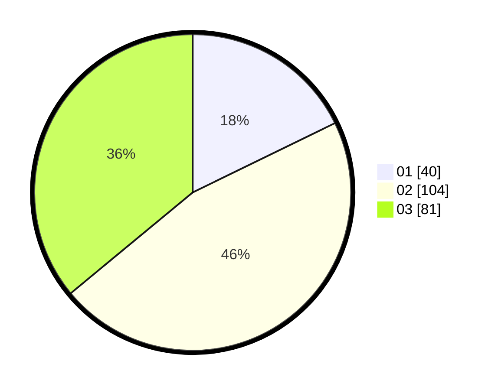

# Hasil

Hasil perolehan suara paslon dapat dilihat pada file paslon-01.txt, paslon-02.txt, dan paslon-03.txt.

Jika tidak ada, artinya data tersebut belum ada pada SIREKAP.

## Perolehan Suara

 * Paslon 01: **40**.
 * Paslon 02: **104**.
 * Paslon 03: **81**.

## Foto C Plano

https://sirekap-obj-formc.kpu.go.id/9e70/pemilu/ppwp/31/73/07/10/01/3173071001196-20240218-204700--56160b4a-51a6-4dd9-bacf-56976453d5e6.jpg

https://sirekap-obj-formc.kpu.go.id/9e70/pemilu/ppwp/31/73/07/10/01/3173071001196-20240218-204719--d15e15ed-e69b-4ae4-b205-63cc11f7e56a.jpg

https://sirekap-obj-formc.kpu.go.id/9e70/pemilu/ppwp/31/73/07/10/01/3173071001196-20240218-204728--92404fd3-e6b4-4211-8f8c-c0aed04487fa.jpg
