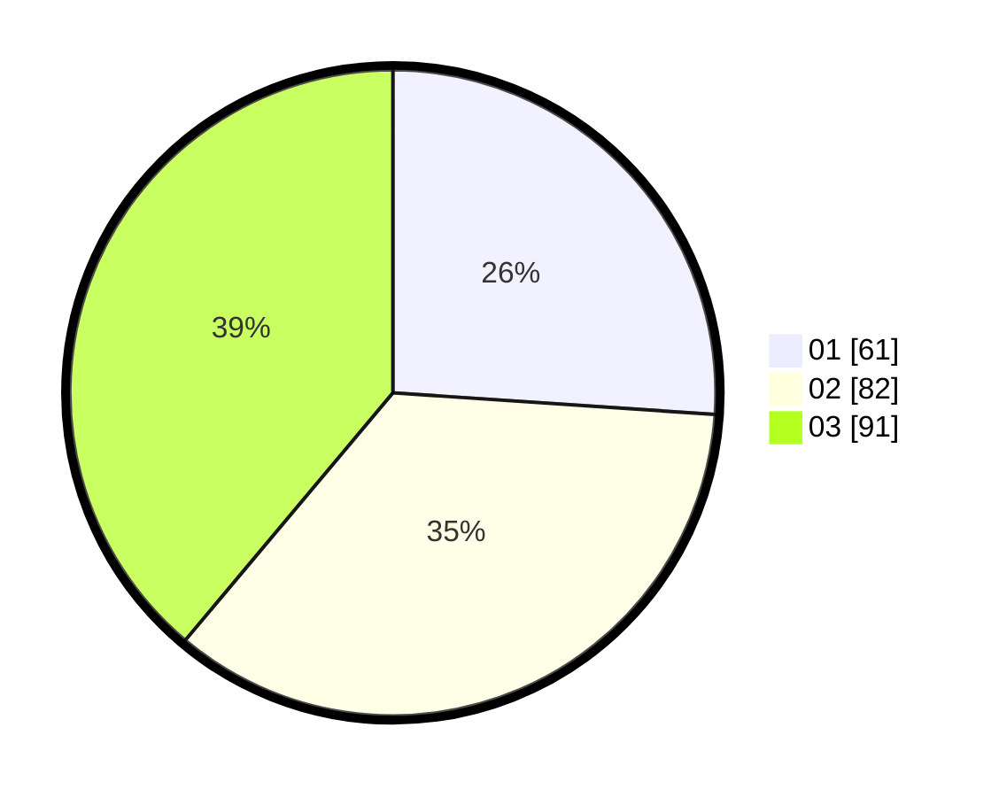

# Hasil

Hasil perolehan suara paslon dapat dilihat pada file paslon-01.txt, paslon-02.txt, dan paslon-03.txt.

Jika tidak ada, artinya data tersebut belum ada pada SIREKAP.

## Perolehan Suara

 * Paslon 01: **61**.
 * Paslon 02: **82**.
 * Paslon 03: **91**.

## Foto C Plano

https://sirekap-obj-formc.kpu.go.id/9d7e/pemilu/ppwp/31/73/07/10/01/3173071001199-20240214-203217--26a257cf-c7b6-4084-a78a-07c18681c437.jpg

https://sirekap-obj-formc.kpu.go.id/9d7e/pemilu/ppwp/31/73/07/10/01/3173071001199-20240214-203257--218b759c-b7ab-4efd-ad49-8c8c1f80afb7.jpg

https://sirekap-obj-formc.kpu.go.id/9d7e/pemilu/ppwp/31/73/07/10/01/3173071001199-20240214-203300--704b8070-563d-4cea-bec8-809bd105f3f4.jpg
