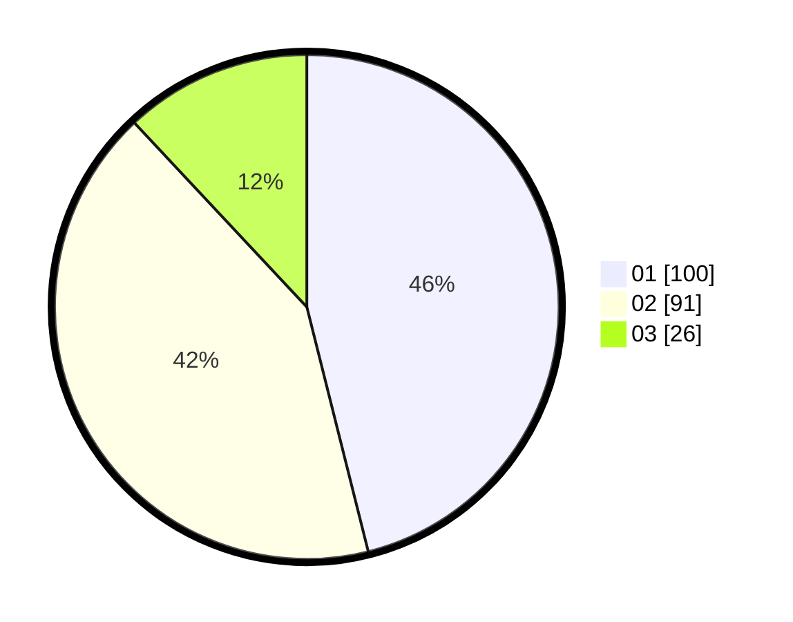

# Hasil

Hasil perolehan suara paslon dapat dilihat pada file paslon-01.txt, paslon-02.txt, dan paslon-03.txt.

Jika tidak ada, artinya data tersebut belum ada pada SIREKAP.

## Perolehan Suara

 * Paslon 01: **100**.
 * Paslon 02: **91**.
 * Paslon 03: **26**.

## Foto C Plano

https://sirekap-obj-formc.kpu.go.id/9aaf/pemilu/ppwp/31/73/07/10/01/3173071001201-20240214-155250--86869766-8ad7-4e09-bd66-6e5064700603.jpg

https://sirekap-obj-formc.kpu.go.id/9aaf/pemilu/ppwp/31/73/07/10/01/3173071001201-20240214-155245--75267c5b-bfad-47b0-90c1-a405a486591b.jpg

https://sirekap-obj-formc.kpu.go.id/9aaf/pemilu/ppwp/31/73/07/10/01/3173071001201-20240214-155603--4e10962e-14cc-4200-a4ca-e4d866d38bf1.jpg
