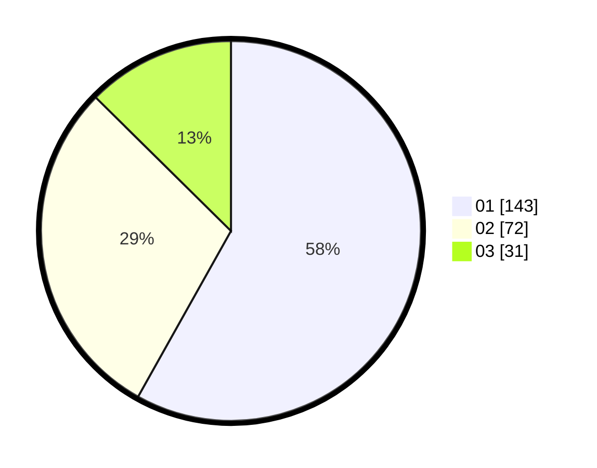

# Hasil

Hasil perolehan suara paslon dapat dilihat pada file paslon-01.txt, paslon-02.txt, dan paslon-03.txt.

Jika tidak ada, artinya data tersebut belum ada pada SIREKAP.

## Perolehan Suara

 * Paslon 01: **143**.
 * Paslon 02: **72**.
 * Paslon 03: **31**.

## Foto C Plano

https://sirekap-obj-formc.kpu.go.id/b248/pemilu/ppwp/31/73/07/10/01/3173071001212-20240214-214755--0d451ee7-5b30-41e3-920d-02dacfaa29ed.jpg

https://sirekap-obj-formc.kpu.go.id/b248/pemilu/ppwp/31/73/07/10/01/3173071001212-20240214-214917--08a1af84-2347-4690-bab2-d4adad45555a.jpg

https://sirekap-obj-formc.kpu.go.id/b248/pemilu/ppwp/31/73/07/10/01/3173071001212-20240214-214956--87fd5384-6542-4a76-9a17-2c33854c78bf.jpg
