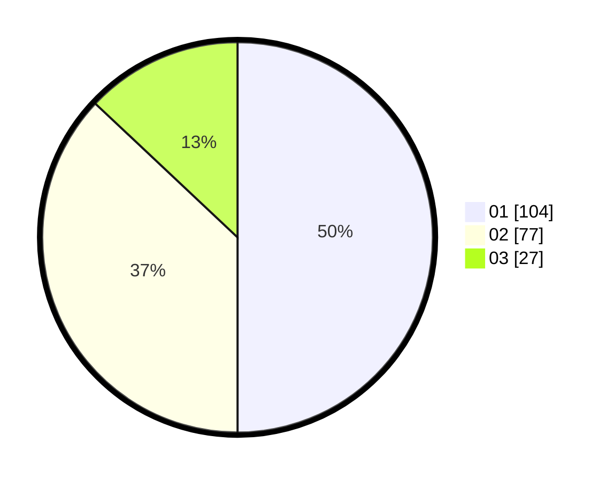

# Hasil

Hasil perolehan suara paslon dapat dilihat pada file paslon-01.txt, paslon-02.txt, dan paslon-03.txt.

Jika tidak ada, artinya data tersebut belum ada pada SIREKAP.

## Perolehan Suara

 * Paslon 01: **104**.
 * Paslon 02: **77**.
 * Paslon 03: **27**.

## Foto C Plano

https://sirekap-obj-formc.kpu.go.id/30cb/pemilu/ppwp/31/73/07/10/01/3173071001215-20240214-224934--1b58e035-7767-43c7-9276-8d9e66d85e5f.jpg

https://sirekap-obj-formc.kpu.go.id/30cb/pemilu/ppwp/31/73/07/10/01/3173071001215-20240214-225213--871e7279-51ed-4ed6-8da5-f84c8724beed.jpg

https://sirekap-obj-formc.kpu.go.id/30cb/pemilu/ppwp/31/73/07/10/01/3173071001215-20240214-225310--27df6aba-67ad-4ddc-93ad-ab424f064627.jpg

## DATA PEMILIH TETAP

Jumlah pemilih dalam DPT: **283**.
 * L: **133**.
 * P: **150**.

## DATA PENGGUNA HAK PILIH

Jumlah pengguna hak pilih dalam DPT: **210**.
 * L: **99**.
 * P: **111**.

Jumlah pengguna hak pilih dalam DPTb: **0**.
 * L: **0**.
 * P: **0**.

Jumlah pengguna hak pilih dalam DPK: **0**.
 * L: **0**.
 * P: **0**.

Jumlah pengguna hak pilih: **210**.
 * L: **99**.
 * P: **111**.

## JUMLAH SUARA SAH DAN TIDAK SAH

JUMLAH SELURUH SUARA SAH: **208**.

JUMLAH SUARA TIDAK SAH: **2**.

JUMLAH SELURUH SUARA SAH DAN SUARA TIDAK SAH: **210**.
