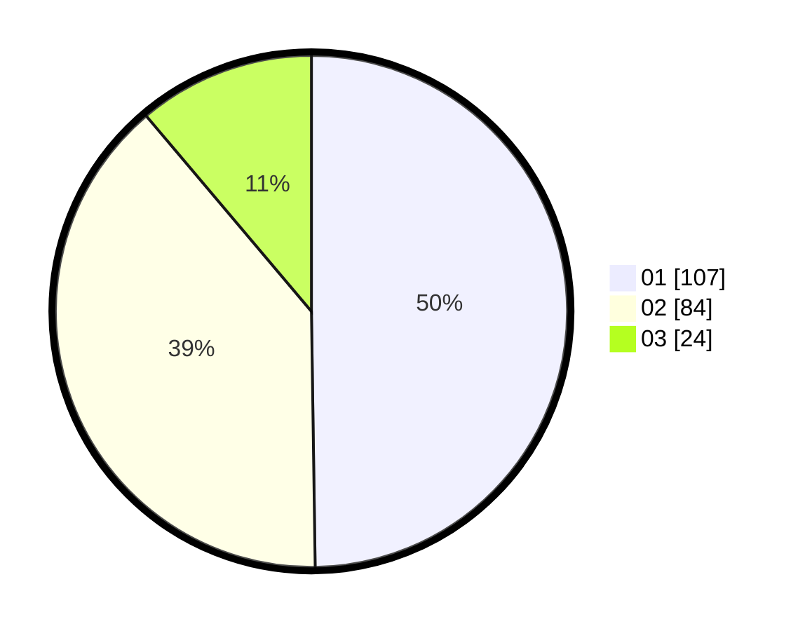

# Hasil

Hasil perolehan suara paslon dapat dilihat pada file paslon-01.txt, paslon-02.txt, dan paslon-03.txt.

Jika tidak ada, artinya data tersebut belum ada pada SIREKAP.

## Perolehan Suara

 * Paslon 01: **107**.
 * Paslon 02: **84**.
 * Paslon 03: **24**.

## Foto C Plano

https://sirekap-obj-formc.kpu.go.id/62e0/pemilu/ppwp/31/73/07/10/01/3173071001216-20240214-224751--61ee6662-2500-47c2-8ee2-dbe590d437a6.jpg

https://sirekap-obj-formc.kpu.go.id/62e0/pemilu/ppwp/31/73/07/10/01/3173071001216-20240214-225502--e95f4ef1-6d7d-40b2-94fa-4c71009ea983.jpg

https://sirekap-obj-formc.kpu.go.id/62e0/pemilu/ppwp/31/73/07/10/01/3173071001216-20240214-230038--8fbb5ebc-0a67-4541-9f15-667f6693079b.jpg
