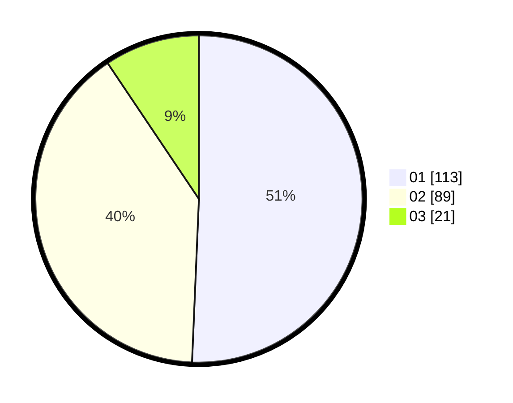

# Hasil

Hasil perolehan suara paslon dapat dilihat pada file paslon-01.txt, paslon-02.txt, dan paslon-03.txt.

Jika tidak ada, artinya data tersebut belum ada pada SIREKAP.

## Perolehan Suara

 * Paslon 01: **113**.
 * Paslon 02: **89**.
 * Paslon 03: **21**.

## Foto C Plano

https://sirekap-obj-formc.kpu.go.id/8dac/pemilu/ppwp/31/73/07/10/02/3173071002009-20240216-143118--41d9721e-361e-428d-ba2b-dc86af3079ed.jpg

https://sirekap-obj-formc.kpu.go.id/8dac/pemilu/ppwp/31/73/07/10/02/3173071002009-20240216-143119--f60aa77f-d5c3-4cb3-8f07-32740753c0c4.jpg

https://sirekap-obj-formc.kpu.go.id/8dac/pemilu/ppwp/31/73/07/10/02/3173071002009-20240216-143118--e42a8165-ed45-46b9-8e4c-86e9100c34f7.jpg

## DATA PEMILIH TETAP

Jumlah pemilih dalam DPT: **264**.
 * L: **129**.
 * P: **135**.

## DATA PENGGUNA HAK PILIH

Jumlah pengguna hak pilih dalam DPT: **211**.
 * L: **106**.
 * P: **105**.

Jumlah pengguna hak pilih dalam DPTb: **13**.
 * L: **3**.
 * P: **10**.

Jumlah pengguna hak pilih dalam DPK: **2**.
 * L: **1**.
 * P: **1**.

Jumlah pengguna hak pilih: **226**.
 * L: **110**.
 * P: **116**.

## JUMLAH SUARA SAH DAN TIDAK SAH

JUMLAH SELURUH SUARA SAH: **223**.

JUMLAH SUARA TIDAK SAH: **3**.

JUMLAH SELURUH SUARA SAH DAN SUARA TIDAK SAH: **226**.
