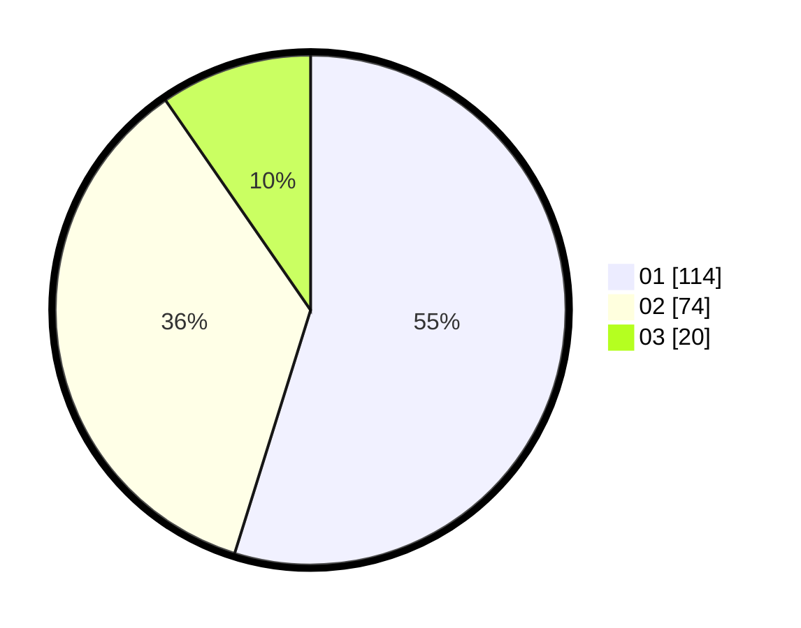

# Hasil

Hasil perolehan suara paslon dapat dilihat pada file paslon-01.txt, paslon-02.txt, dan paslon-03.txt.

Jika tidak ada, artinya data tersebut belum ada pada SIREKAP.

## Perolehan Suara

 * Paslon 01: **114**.
 * Paslon 02: **74**.
 * Paslon 03: **20**.

## Foto C Plano

https://sirekap-obj-formc.kpu.go.id/d878/pemilu/ppwp/31/73/07/10/02/3173071002011-20240214-185655--f5bf2c65-252f-4f84-a3e0-cfb98cfc8034.jpg

https://sirekap-obj-formc.kpu.go.id/d878/pemilu/ppwp/31/73/07/10/02/3173071002011-20240214-185806--912bfdf7-6225-4fc9-9586-26a3d0f72e12.jpg

https://sirekap-obj-formc.kpu.go.id/d878/pemilu/ppwp/31/73/07/10/02/3173071002011-20240215-221754--4bd917ae-fd92-401a-9b4f-7735a41d2189.jpg

## DATA PEMILIH TETAP

Jumlah pemilih dalam DPT: **247**.
 * L: **127**.
 * P: **120**.

## DATA PENGGUNA HAK PILIH

Jumlah pengguna hak pilih dalam DPT: **199**.
 * L: **97**.
 * P: **102**.

Jumlah pengguna hak pilih dalam DPTb: **13**.
 * L: **3**.
 * P: **10**.

Jumlah pengguna hak pilih dalam DPK: **0**.
 * L: **0**.
 * P: **0**.

Jumlah pengguna hak pilih: **212**.
 * L: **100**.
 * P: **112**.

## JUMLAH SUARA SAH DAN TIDAK SAH

JUMLAH SELURUH SUARA SAH: **208**.

JUMLAH SUARA TIDAK SAH: **4**.

JUMLAH SELURUH SUARA SAH DAN SUARA TIDAK SAH: **212**.
