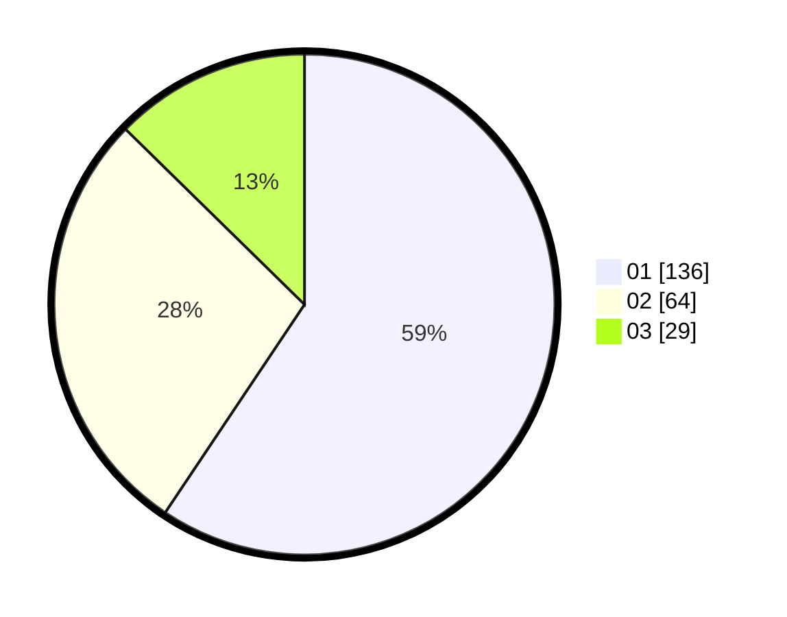

# Hasil

Hasil perolehan suara paslon dapat dilihat pada file paslon-01.txt, paslon-02.txt, dan paslon-03.txt.

Jika tidak ada, artinya data tersebut belum ada pada SIREKAP.

## Perolehan Suara

 * Paslon 01: **136**.
 * Paslon 02: **64**.
 * Paslon 03: **29**.

## Foto C Plano

https://sirekap-obj-formc.kpu.go.id/e7d1/pemilu/ppwp/31/73/07/10/02/3173071002014-20240215-024039--be56811a-9221-46a7-9452-29f5d32f98fa.jpg

https://sirekap-obj-formc.kpu.go.id/e7d1/pemilu/ppwp/31/73/07/10/02/3173071002014-20240216-145130--3473686c-521d-484a-ad61-e9f07621173d.jpg

https://sirekap-obj-formc.kpu.go.id/e7d1/pemilu/ppwp/31/73/07/10/02/3173071002014-20240215-024119--e2cd0f8f-4838-42c4-9454-19812d0f6705.jpg

## DATA PEMILIH TETAP

Jumlah pemilih dalam DPT: **264**.
 * L: **121**.
 * P: **143**.

## DATA PENGGUNA HAK PILIH

Jumlah pengguna hak pilih dalam DPT: **216**.
 * L: **91**.
 * P: **125**.

Jumlah pengguna hak pilih dalam DPTb: **13**.
 * L: **5**.
 * P: **8**.

Jumlah pengguna hak pilih dalam DPK: **2**.
 * L: **1**.
 * P: **1**.

Jumlah pengguna hak pilih: **231**.
 * L: **97**.
 * P: **134**.

## JUMLAH SUARA SAH DAN TIDAK SAH

JUMLAH SELURUH SUARA SAH: **229**.

JUMLAH SUARA TIDAK SAH: **2**.

JUMLAH SELURUH SUARA SAH DAN SUARA TIDAK SAH: **231**.
