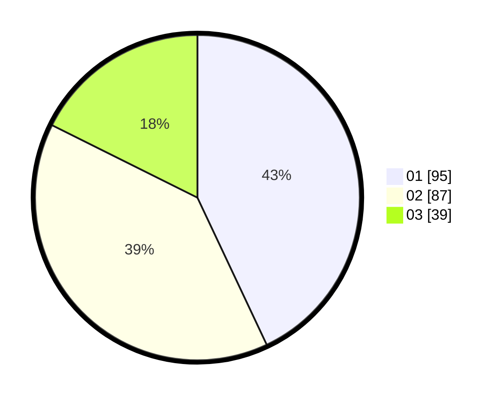

# Hasil

Hasil perolehan suara paslon dapat dilihat pada file paslon-01.txt, paslon-02.txt, dan paslon-03.txt.

Jika tidak ada, artinya data tersebut belum ada pada SIREKAP.

## Perolehan Suara

 * Paslon 01: **95**.
 * Paslon 02: **87**.
 * Paslon 03: **39**.

## Foto C Plano

https://sirekap-obj-formc.kpu.go.id/5f8e/pemilu/ppwp/31/73/07/10/02/3173071002015-20240216-033617--08de5e6e-e72d-4ce3-9432-2d27581d3fa2.jpg

https://sirekap-obj-formc.kpu.go.id/5f8e/pemilu/ppwp/31/73/07/10/02/3173071002015-20240216-033627--9da52643-6c83-40a0-9f19-68d18952bbb8.jpg

https://sirekap-obj-formc.kpu.go.id/5f8e/pemilu/ppwp/31/73/07/10/02/3173071002015-20240216-033626--f64ad96c-9922-4c7c-ab38-e65efa9488b1.jpg

## DATA PEMILIH TETAP

Jumlah pemilih dalam DPT: **266**.
 * L: **120**.
 * P: **146**.

## DATA PENGGUNA HAK PILIH

Jumlah pengguna hak pilih dalam DPT: **210**.
 * L: **92**.
 * P: **118**.

Jumlah pengguna hak pilih dalam DPTb: **11**.
 * L: **5**.
 * P: **6**.

Jumlah pengguna hak pilih dalam DPK: **1**.
 * L: **0**.
 * P: **1**.

Jumlah pengguna hak pilih: **222**.
 * L: **97**.
 * P: **125**.

## JUMLAH SUARA SAH DAN TIDAK SAH

JUMLAH SELURUH SUARA SAH: **221**.

JUMLAH SUARA TIDAK SAH: **1**.

JUMLAH SELURUH SUARA SAH DAN SUARA TIDAK SAH: **222**.
