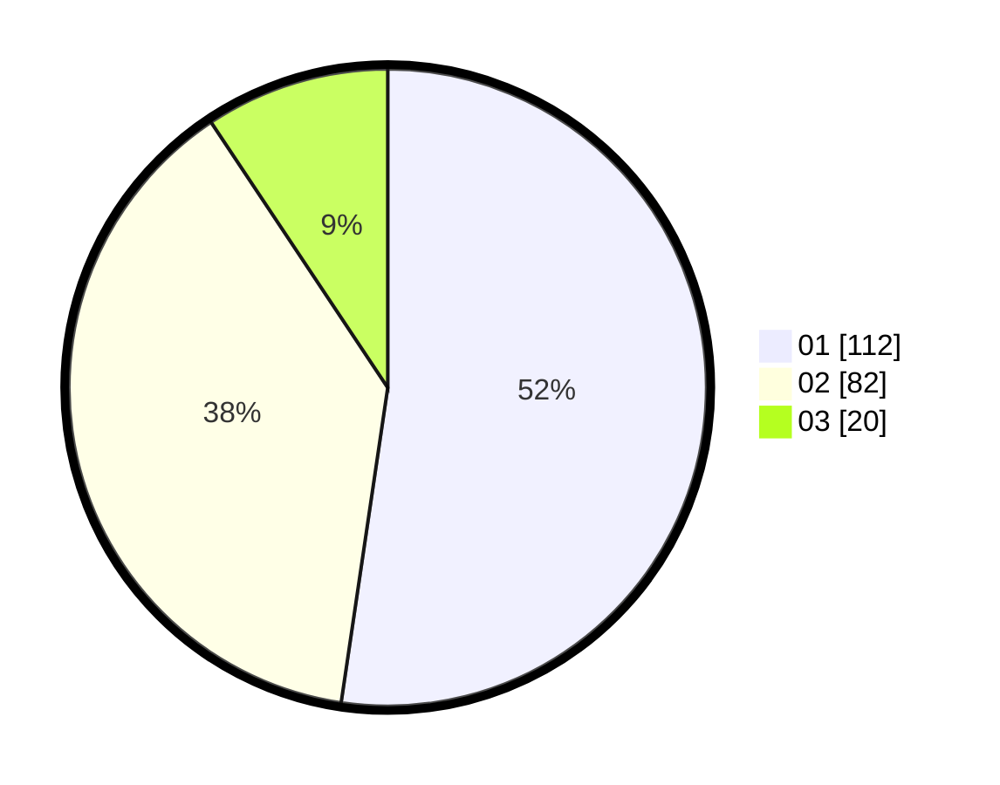

# Hasil

Hasil perolehan suara paslon dapat dilihat pada file paslon-01.txt, paslon-02.txt, dan paslon-03.txt.

Jika tidak ada, artinya data tersebut belum ada pada SIREKAP.

## Perolehan Suara

 * Paslon 01: **112**.
 * Paslon 02: **82**.
 * Paslon 03: **20**.

## Foto C Plano

https://sirekap-obj-formc.kpu.go.id/9c1f/pemilu/ppwp/31/73/07/10/02/3173071002016-20240216-082131--0ed40035-94e5-4486-bd7e-56d561eb585f.jpg

https://sirekap-obj-formc.kpu.go.id/9c1f/pemilu/ppwp/31/73/07/10/02/3173071002016-20240216-082135--ac714af5-293f-49c3-b286-ab0248e31775.jpg

https://sirekap-obj-formc.kpu.go.id/9c1f/pemilu/ppwp/31/73/07/10/02/3173071002016-20240216-082133--977e1a5e-f0bd-40b1-8919-217842ac854d.jpg

## DATA PEMILIH TETAP

Jumlah pemilih dalam DPT: **275**.
 * L: **142**.
 * P: **133**.

## DATA PENGGUNA HAK PILIH

Jumlah pengguna hak pilih dalam DPT: **200**.
 * L: **104**.
 * P: **96**.

Jumlah pengguna hak pilih dalam DPTb: **9**.
 * L: **6**.
 * P: **3**.

Jumlah pengguna hak pilih dalam DPK: **6**.
 * L: **4**.
 * P: **2**.

Jumlah pengguna hak pilih: **215**.
 * L: **114**.
 * P: **101**.

## JUMLAH SUARA SAH DAN TIDAK SAH

JUMLAH SELURUH SUARA SAH: **214**.

JUMLAH SUARA TIDAK SAH: **1**.

JUMLAH SELURUH SUARA SAH DAN SUARA TIDAK SAH: **215**.
