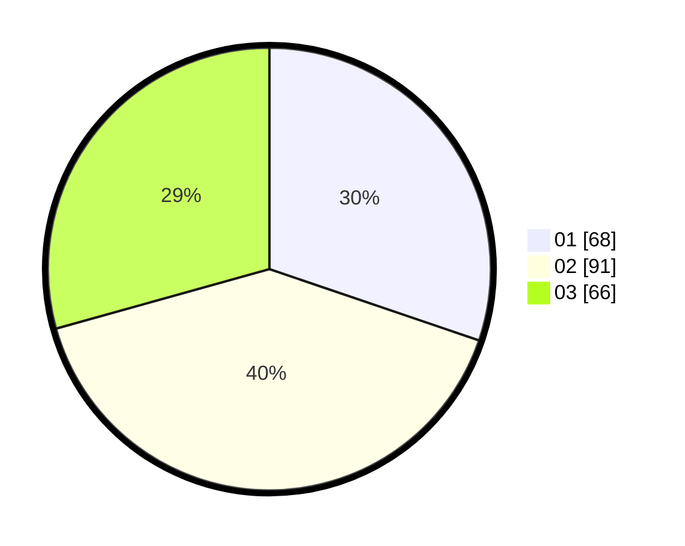

# Hasil

Hasil perolehan suara paslon dapat dilihat pada file paslon-01.txt, paslon-02.txt, dan paslon-03.txt.

Jika tidak ada, artinya data tersebut belum ada pada SIREKAP.

## Perolehan Suara

 * Paslon 01: **68**.
 * Paslon 02: **91**.
 * Paslon 03: **66**.

## Foto C Plano

https://sirekap-obj-formc.kpu.go.id/13e9/pemilu/ppwp/31/73/07/10/02/3173071002017-20240216-073754--df21436f-3df7-42f0-b3cc-0a2859b24c34.jpg

https://sirekap-obj-formc.kpu.go.id/13e9/pemilu/ppwp/31/73/07/10/02/3173071002017-20240216-111326--043c5e15-f210-4e01-b92f-0160a210426f.jpg

https://sirekap-obj-formc.kpu.go.id/13e9/pemilu/ppwp/31/73/07/10/02/3173071002017-20240216-073803--74e84c66-f0bb-4a45-88aa-f1c0894e2868.jpg

## DATA PEMILIH TETAP

Jumlah pemilih dalam DPT: **269**.
 * L: **134**.
 * P: **135**.

## DATA PENGGUNA HAK PILIH

Jumlah pengguna hak pilih dalam DPT: **209**.
 * L: **108**.
 * P: **101**.

Jumlah pengguna hak pilih dalam DPTb: **10**.
 * L: **5**.
 * P: **5**.

Jumlah pengguna hak pilih dalam DPK: **8**.
 * L: **5**.
 * P: **3**.

Jumlah pengguna hak pilih: **227**.
 * L: **118**.
 * P: **109**.

## JUMLAH SUARA SAH DAN TIDAK SAH

JUMLAH SELURUH SUARA SAH: **225**.

JUMLAH SUARA TIDAK SAH: **2**.

JUMLAH SELURUH SUARA SAH DAN SUARA TIDAK SAH: **227**.
