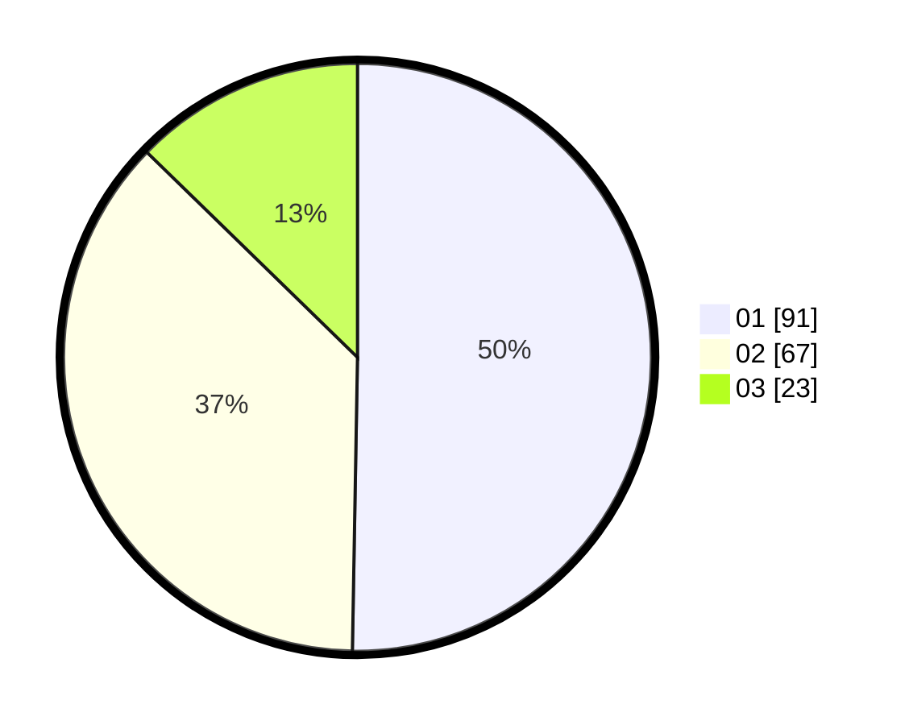

# Hasil

Hasil perolehan suara paslon dapat dilihat pada file paslon-01.txt, paslon-02.txt, dan paslon-03.txt.

Jika tidak ada, artinya data tersebut belum ada pada SIREKAP.

## Perolehan Suara

 * Paslon 01: **91**.
 * Paslon 02: **67**.
 * Paslon 03: **23**.

## Foto C Plano

https://sirekap-obj-formc.kpu.go.id/5f36/pemilu/ppwp/31/73/07/10/02/3173071002018-20240215-205909--afa29d6f-fa66-4b3f-8d83-9beb1fbcf818.jpg

https://sirekap-obj-formc.kpu.go.id/5f36/pemilu/ppwp/31/73/07/10/02/3173071002018-20240215-205913--0576c614-a4e1-4290-83c1-017ccd5de286.jpg

https://sirekap-obj-formc.kpu.go.id/5f36/pemilu/ppwp/31/73/07/10/02/3173071002018-20240215-205912--94ecb99a-73ed-4901-89c7-06bd86a90284.jpg

## DATA PEMILIH TETAP

Jumlah pemilih dalam DPT: **234**.
 * L: **115**.
 * P: **119**.

## DATA PENGGUNA HAK PILIH

Jumlah pengguna hak pilih dalam DPT: **170**.
 * L: **77**.
 * P: **93**.

Jumlah pengguna hak pilih dalam DPTb: **10**.
 * L: **5**.
 * P: **5**.

Jumlah pengguna hak pilih dalam DPK: **4**.
 * L: **1**.
 * P: **3**.

Jumlah pengguna hak pilih: **184**.
 * L: **83**.
 * P: **101**.

## JUMLAH SUARA SAH DAN TIDAK SAH

JUMLAH SELURUH SUARA SAH: **181**.

JUMLAH SUARA TIDAK SAH: **3**.

JUMLAH SELURUH SUARA SAH DAN SUARA TIDAK SAH: **184**.
