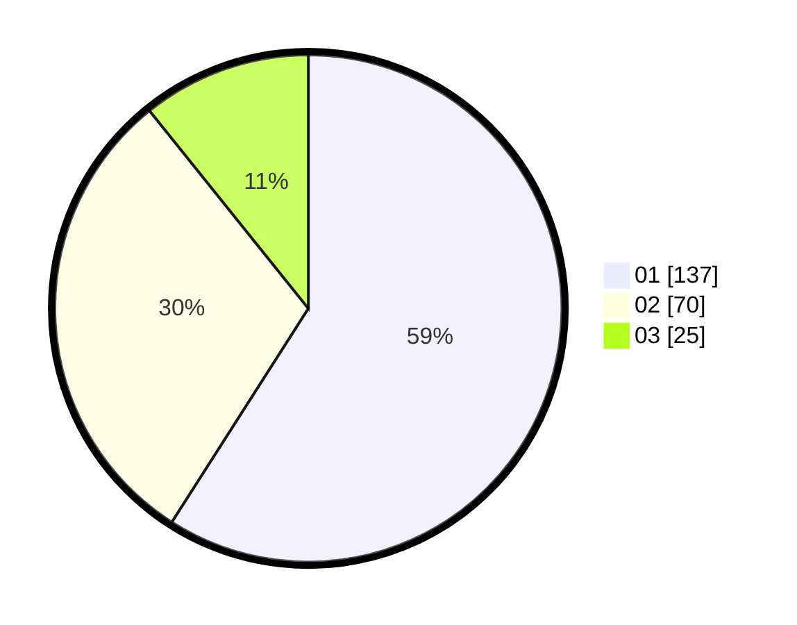

# Hasil

Hasil perolehan suara paslon dapat dilihat pada file paslon-01.txt, paslon-02.txt, dan paslon-03.txt.

Jika tidak ada, artinya data tersebut belum ada pada SIREKAP.

## Perolehan Suara

 * Paslon 01: **137**.
 * Paslon 02: **70**.
 * Paslon 03: **25**.

## Foto C Plano

https://sirekap-obj-formc.kpu.go.id/3014/pemilu/ppwp/31/73/07/10/02/3173071002019-20240216-093636--81c90d07-bc86-418d-8679-ec8860911c0d.jpg

https://sirekap-obj-formc.kpu.go.id/3014/pemilu/ppwp/31/73/07/10/02/3173071002019-20240216-093646--a7dc1780-cfaf-4afc-b5f8-38e6e27be020.jpg

https://sirekap-obj-formc.kpu.go.id/3014/pemilu/ppwp/31/73/07/10/02/3173071002019-20240216-080216--2182e47b-3d6d-49a5-98d7-9f7564070f0d.jpg

## DATA PEMILIH TETAP

Jumlah pemilih dalam DPT: **269**.
 * L: **129**.
 * P: **140**.

## DATA PENGGUNA HAK PILIH

Jumlah pengguna hak pilih dalam DPT: **221**.
 * L: **104**.
 * P: **117**.

Jumlah pengguna hak pilih dalam DPTb: **11**.
 * L: **8**.
 * P: **3**.

Jumlah pengguna hak pilih dalam DPK: **0**.
 * L: **0**.
 * P: **0**.

Jumlah pengguna hak pilih: **232**.
 * L: **112**.
 * P: **120**.

## JUMLAH SUARA SAH DAN TIDAK SAH

JUMLAH SELURUH SUARA SAH: **232**.

JUMLAH SUARA TIDAK SAH: **0**.

JUMLAH SELURUH SUARA SAH DAN SUARA TIDAK SAH: **232**.
