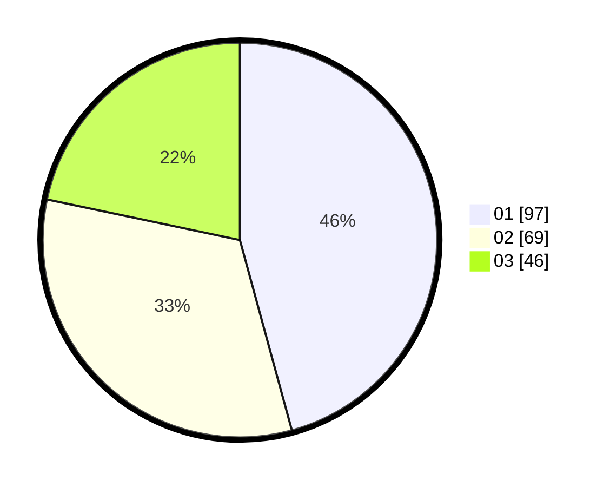

# Hasil

Hasil perolehan suara paslon dapat dilihat pada file paslon-01.txt, paslon-02.txt, dan paslon-03.txt.

Jika tidak ada, artinya data tersebut belum ada pada SIREKAP.

## Perolehan Suara

 * Paslon 01: **97**.
 * Paslon 02: **69**.
 * Paslon 03: **46**.

## Foto C Plano

https://sirekap-obj-formc.kpu.go.id/b423/pemilu/ppwp/31/73/07/10/02/3173071002023-20240215-054019--94a7912d-902d-4a19-92a3-7b4d39d389ee.jpg

https://sirekap-obj-formc.kpu.go.id/b423/pemilu/ppwp/31/73/07/10/02/3173071002023-20240215-054024--1d9c7404-a8be-461b-a062-262b494e76f2.jpg

https://sirekap-obj-formc.kpu.go.id/b423/pemilu/ppwp/31/73/07/10/02/3173071002023-20240215-054037--ef0d7d2b-a4e1-4c80-8c76-fc553ed469c8.jpg
