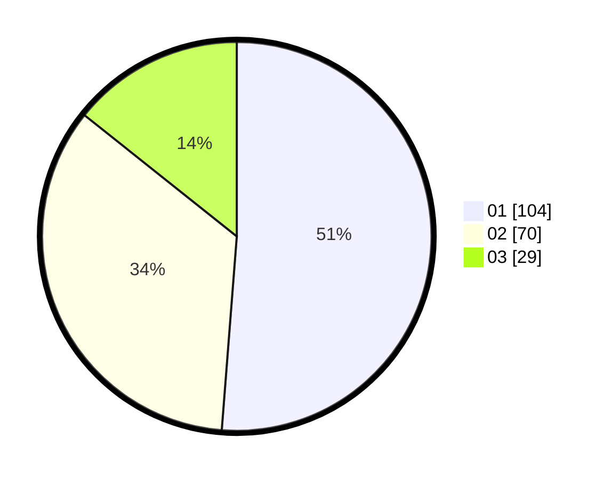

# Hasil

Hasil perolehan suara paslon dapat dilihat pada file paslon-01.txt, paslon-02.txt, dan paslon-03.txt.

Jika tidak ada, artinya data tersebut belum ada pada SIREKAP.

## Perolehan Suara

 * Paslon 01: **104**.
 * Paslon 02: **70**.
 * Paslon 03: **29**.

## Foto C Plano

https://sirekap-obj-formc.kpu.go.id/5bb3/pemilu/ppwp/31/73/07/10/02/3173071002028-20240214-194854--efb66226-cfc6-4b30-bf2c-bc26b69ed474.jpg

https://sirekap-obj-formc.kpu.go.id/5bb3/pemilu/ppwp/31/73/07/10/02/3173071002028-20240214-194916--279ee5ab-2b1a-4a1e-baa5-6aafe7eebbe1.jpg

https://sirekap-obj-formc.kpu.go.id/5bb3/pemilu/ppwp/31/73/07/10/02/3173071002028-20240214-194905--882b4b67-ce4e-4c37-84ef-71f67e29dcf1.jpg

## DATA PEMILIH TETAP

Jumlah pemilih dalam DPT: **264**.
 * L: **129**.
 * P: **135**.

## DATA PENGGUNA HAK PILIH

Jumlah pengguna hak pilih dalam DPT: **192**.
 * L: **92**.
 * P: **100**.

Jumlah pengguna hak pilih dalam DPTb: **10**.
 * L: **9**.
 * P: **1**.

Jumlah pengguna hak pilih dalam DPK: **2**.
 * L: **2**.
 * P: **0**.

Jumlah pengguna hak pilih: **204**.
 * L: **103**.
 * P: **101**.

## JUMLAH SUARA SAH DAN TIDAK SAH

JUMLAH SELURUH SUARA SAH: **203**.

JUMLAH SUARA TIDAK SAH: **1**.

JUMLAH SELURUH SUARA SAH DAN SUARA TIDAK SAH: **204**.
