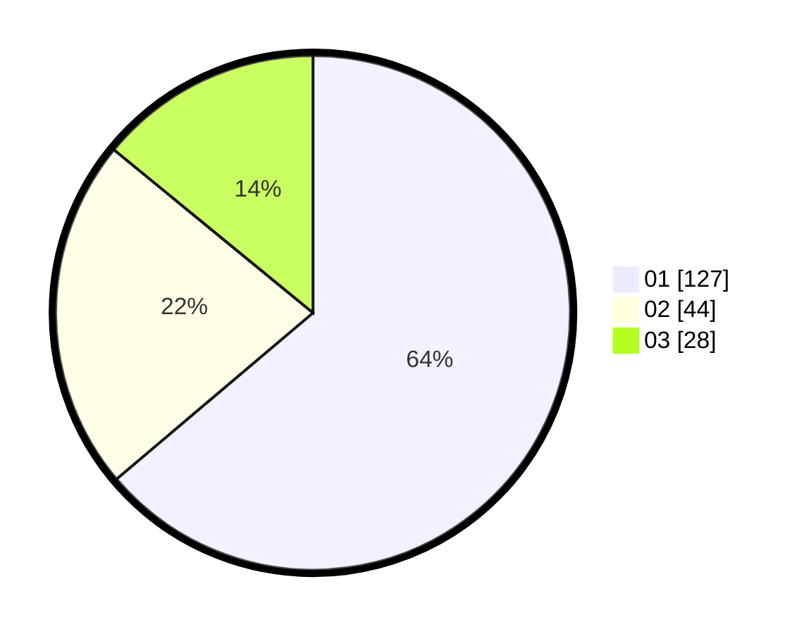

# Hasil

Hasil perolehan suara paslon dapat dilihat pada file paslon-01.txt, paslon-02.txt, dan paslon-03.txt.

Jika tidak ada, artinya data tersebut belum ada pada SIREKAP.

## Perolehan Suara

 * Paslon 01: **127**.
 * Paslon 02: **44**.
 * Paslon 03: **28**.

## Foto C Plano

https://sirekap-obj-formc.kpu.go.id/bedb/pemilu/ppwp/31/73/07/10/02/3173071002031-20240214-164632--f90fca39-39cc-49f2-9989-a31cadf49ec1.jpg

https://sirekap-obj-formc.kpu.go.id/bedb/pemilu/ppwp/31/73/07/10/02/3173071002031-20240214-164633--97efdde7-b92f-4f3c-afd1-aab55ba8644b.jpg

https://sirekap-obj-formc.kpu.go.id/bedb/pemilu/ppwp/31/73/07/10/02/3173071002031-20240214-164633--23f8931e-5551-4c40-9f02-dcbec4f0672d.jpg

## DATA PEMILIH TETAP

Jumlah pemilih dalam DPT: **245**.
 * L: **120**.
 * P: **125**.

## DATA PENGGUNA HAK PILIH

Jumlah pengguna hak pilih dalam DPT: **185**.
 * L: **83**.
 * P: **102**.

Jumlah pengguna hak pilih dalam DPTb: **13**.
 * L: **5**.
 * P: **8**.

Jumlah pengguna hak pilih dalam DPK: **1**.
 * L: **1**.
 * P: **0**.

Jumlah pengguna hak pilih: **199**.
 * L: **89**.
 * P: **110**.

## JUMLAH SUARA SAH DAN TIDAK SAH

JUMLAH SELURUH SUARA SAH: **199**.

JUMLAH SUARA TIDAK SAH: **0**.

JUMLAH SELURUH SUARA SAH DAN SUARA TIDAK SAH: **0**.
