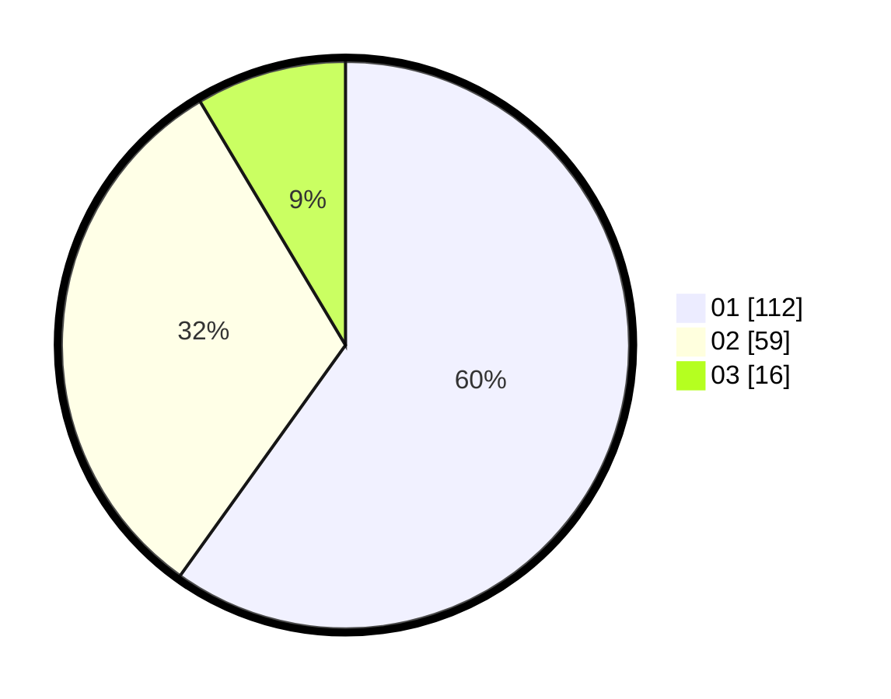

# Hasil

Hasil perolehan suara paslon dapat dilihat pada file paslon-01.txt, paslon-02.txt, dan paslon-03.txt.

Jika tidak ada, artinya data tersebut belum ada pada SIREKAP.

## Perolehan Suara

 * Paslon 01: **112**.
 * Paslon 02: **59**.
 * Paslon 03: **16**.

## Foto C Plano

https://sirekap-obj-formc.kpu.go.id/2f53/pemilu/ppwp/31/73/07/10/02/3173071002033-20240216-143110--6fec8498-1a1e-438b-bed0-0ba08daabab1.jpg

https://sirekap-obj-formc.kpu.go.id/2f53/pemilu/ppwp/31/73/07/10/02/3173071002033-20240214-220531--fb07af7f-bb23-458c-93eb-5640f83309a4.jpg

https://sirekap-obj-formc.kpu.go.id/2f53/pemilu/ppwp/31/73/07/10/02/3173071002033-20240215-004000--568d421f-14d3-44b0-9039-7d4adac9d494.jpg
