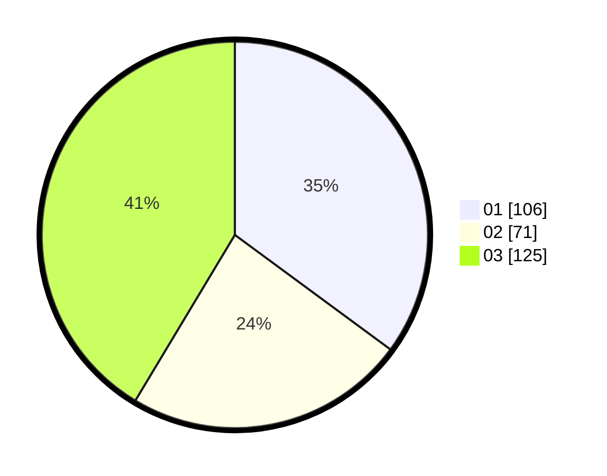

# Hasil

Hasil perolehan suara paslon dapat dilihat pada file paslon-01.txt, paslon-02.txt, dan paslon-03.txt.

Jika tidak ada, artinya data tersebut belum ada pada SIREKAP.

## Perolehan Suara

 * Paslon 01: **106**.
 * Paslon 02: **71**.
 * Paslon 03: **125**.

## Foto C Plano

https://sirekap-obj-formc.kpu.go.id/b783/pemilu/ppwp/31/73/07/10/02/3173071002034-20240215-204603--d0838c48-a35c-4bc9-949b-ccf9f2060a9b.jpg

https://sirekap-obj-formc.kpu.go.id/b783/pemilu/ppwp/31/73/07/10/02/3173071002034-20240215-204605--2b76d911-25d5-4bf8-bfcd-6d1c0ffe609a.jpg

https://sirekap-obj-formc.kpu.go.id/b783/pemilu/ppwp/31/73/07/10/02/3173071002034-20240215-204604--426306b5-e2d0-4076-bbe9-542e9e1600a3.jpg

## DATA PEMILIH TETAP

Jumlah pemilih dalam DPT: **239**.
 * L: **118**.
 * P: **121**.

## DATA PENGGUNA HAK PILIH

Jumlah pengguna hak pilih dalam DPT: **195**.
 * L: **97**.
 * P: **98**.

Jumlah pengguna hak pilih dalam DPTb: **7**.
 * L: **1**.
 * P: **6**.

Jumlah pengguna hak pilih dalam DPK: **2**.
 * L: **1**.
 * P: **1**.

Jumlah pengguna hak pilih: **204**.
 * L: **99**.
 * P: **105**.

## JUMLAH SUARA SAH DAN TIDAK SAH

JUMLAH SELURUH SUARA SAH: **202**.

JUMLAH SUARA TIDAK SAH: **2**.

JUMLAH SELURUH SUARA SAH DAN SUARA TIDAK SAH: **204**.
