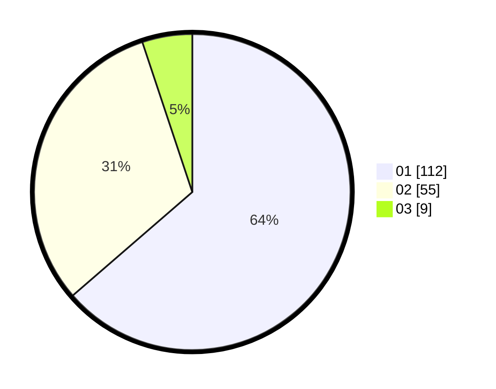

# Hasil

Hasil perolehan suara paslon dapat dilihat pada file paslon-01.txt, paslon-02.txt, dan paslon-03.txt.

Jika tidak ada, artinya data tersebut belum ada pada SIREKAP.

## Perolehan Suara

 * Paslon 01: **112**.
 * Paslon 02: **55**.
 * Paslon 03: **9**.

## Foto C Plano

https://sirekap-obj-formc.kpu.go.id/cda0/pemilu/ppwp/31/73/07/10/02/3173071002036-20240216-130957--022b1168-21fe-4244-be2a-cdf86e12282d.jpg

https://sirekap-obj-formc.kpu.go.id/cda0/pemilu/ppwp/31/73/07/10/02/3173071002036-20240216-130958--233d2acc-89cb-4abb-a386-ca8eca553a1d.jpg

https://sirekap-obj-formc.kpu.go.id/cda0/pemilu/ppwp/31/73/07/10/02/3173071002036-20240216-130957--fc975858-660b-49b4-a17c-da496f97a726.jpg

## DATA PEMILIH TETAP

Jumlah pemilih dalam DPT: **197**.
 * L: **99**.
 * P: **98**.

## DATA PENGGUNA HAK PILIH

Jumlah pengguna hak pilih dalam DPT: **171**.
 * L: **86**.
 * P: **85**.

Jumlah pengguna hak pilih dalam DPTb: **8**.
 * L: **1**.
 * P: **7**.

Jumlah pengguna hak pilih dalam DPK: **0**.
 * L: **0**.
 * P: **0**.

Jumlah pengguna hak pilih: **179**.
 * L: **87**.
 * P: **92**.

## JUMLAH SUARA SAH DAN TIDAK SAH

JUMLAH SELURUH SUARA SAH: **176**.

JUMLAH SUARA TIDAK SAH: **2**.

JUMLAH SELURUH SUARA SAH DAN SUARA TIDAK SAH: **178**.
