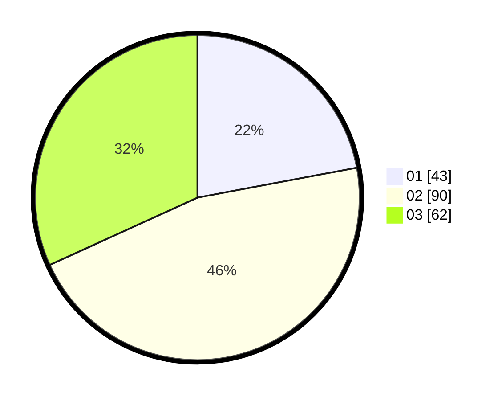

# Hasil

Hasil perolehan suara paslon dapat dilihat pada file paslon-01.txt, paslon-02.txt, dan paslon-03.txt.

Jika tidak ada, artinya data tersebut belum ada pada SIREKAP.

## Perolehan Suara

 * Paslon 01: **43**.
 * Paslon 02: **90**.
 * Paslon 03: **62**.

## Foto C Plano

https://sirekap-obj-formc.kpu.go.id/03ba/pemilu/ppwp/31/73/07/10/02/3173071002039-20240215-035844--0c0b13cb-221c-4376-8512-c13111da69dc.jpg

https://sirekap-obj-formc.kpu.go.id/03ba/pemilu/ppwp/31/73/07/10/02/3173071002039-20240215-035856--1add02b7-ff09-4eae-ab04-28902eea612f.jpg

https://sirekap-obj-formc.kpu.go.id/03ba/pemilu/ppwp/31/73/07/10/02/3173071002039-20240215-035901--0cee9cbe-c141-4a9a-852f-a6d46cf36dfe.jpg

## DATA PEMILIH TETAP

Jumlah pemilih dalam DPT: **243**.
 * L: **113**.
 * P: **130**.

## DATA PENGGUNA HAK PILIH

Jumlah pengguna hak pilih dalam DPT: **190**.
 * L: **84**.
 * P: **106**.

Jumlah pengguna hak pilih dalam DPTb: **9**.
 * L: **5**.
 * P: **4**.

Jumlah pengguna hak pilih dalam DPK: **0**.
 * L: **0**.
 * P: **0**.

Jumlah pengguna hak pilih: **199**.
 * L: **89**.
 * P: **110**.

## JUMLAH SUARA SAH DAN TIDAK SAH

JUMLAH SELURUH SUARA SAH: **195**.

JUMLAH SUARA TIDAK SAH: **4**.

JUMLAH SELURUH SUARA SAH DAN SUARA TIDAK SAH: **199**.
