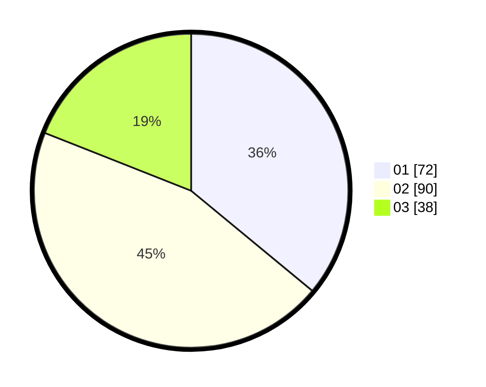

# Hasil

Hasil perolehan suara paslon dapat dilihat pada file paslon-01.txt, paslon-02.txt, dan paslon-03.txt.

Jika tidak ada, artinya data tersebut belum ada pada SIREKAP.

## Perolehan Suara

 * Paslon 01: **72**.
 * Paslon 02: **90**.
 * Paslon 03: **38**.

## Foto C Plano

https://sirekap-obj-formc.kpu.go.id/a56c/pemilu/ppwp/31/73/07/10/02/3173071002041-20240216-132028--faa4c01e-0a40-4bec-a8fe-fa0b4d712470.jpg

https://sirekap-obj-formc.kpu.go.id/a56c/pemilu/ppwp/31/73/07/10/02/3173071002041-20240216-132030--a3ae25ca-6c42-4fbe-ba58-becf664c1c0b.jpg

https://sirekap-obj-formc.kpu.go.id/a56c/pemilu/ppwp/31/73/07/10/02/3173071002041-20240216-132029--101b0771-dd2e-4a63-95ef-8c9fb70ff521.jpg

## DATA PEMILIH TETAP

Jumlah pemilih dalam DPT: **265**.
 * L: **136**.
 * P: **129**.

## DATA PENGGUNA HAK PILIH

Jumlah pengguna hak pilih dalam DPT: **202**.
 * L: **103**.
 * P: **99**.

Jumlah pengguna hak pilih dalam DPTb: **5**.
 * L: **4**.
 * P: **1**.

Jumlah pengguna hak pilih dalam DPK: **1**.
 * L: **0**.
 * P: **1**.

Jumlah pengguna hak pilih: **208**.
 * L: **107**.
 * P: **101**.

## JUMLAH SUARA SAH DAN TIDAK SAH

JUMLAH SELURUH SUARA SAH: **200**.

JUMLAH SUARA TIDAK SAH: **8**.

JUMLAH SELURUH SUARA SAH DAN SUARA TIDAK SAH: **208**.
